# Design and implementation sequence

## Overview

### Phase 1 - Filling backlog

* Stage 0 - Register Feature request
* Stage 1 - Include Feature request to backlog

### Phase 2 - Requirements and scope refinement

* Stage 2 - Feature request analysis planned for the next sprint
* Stage 3 - Requirements, acceptance criteria and scope refinement
* Stage 4 - Preliminary analysis finished

### Phase 3 - Design

* Stage 5 - Detailed design planned for next sprint
* Stage 6 - Detailed design in progress
* Stage 7 - Detailed design done

### Phase 4 - Implementation

* Stage 8 - Planning for implementation
* Stage 9 - "Developer Story" estimated and ready for implementation
* Stage 10 - "Developer Story" implementation by developers, Test Cases design
* Stage 11 - Testing and bug fixing
* Stage 12 - "Developer Story" implemented and ready for deployment
* Stage 13 - "Developer Story" deployed to User Acceptance Testing environment
* Stage 14 - "Developer Story" deployed to Production environment
* Stage 15 - All "Developer Story" issues included in the Epic deployed to Production
* Stage 16 - All Epics in the Feature request deployed to Production

---

## Phase 1 - Filling backlog

### Stage 0 - Register Feature request

"Feature request" registered by Project Owner or Business Analyst with generic description and acceptance criteria.

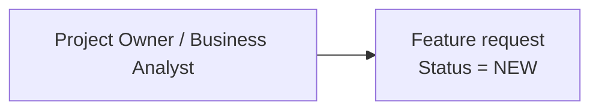

### Stage 1 - Include Feature request to backlog

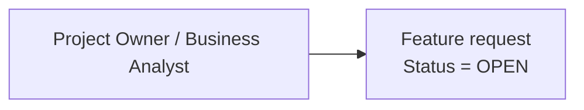

---

## Phase 2 - Requirements and scope refinement

### Stage 2 - Feature request analysis planned for the next sprint

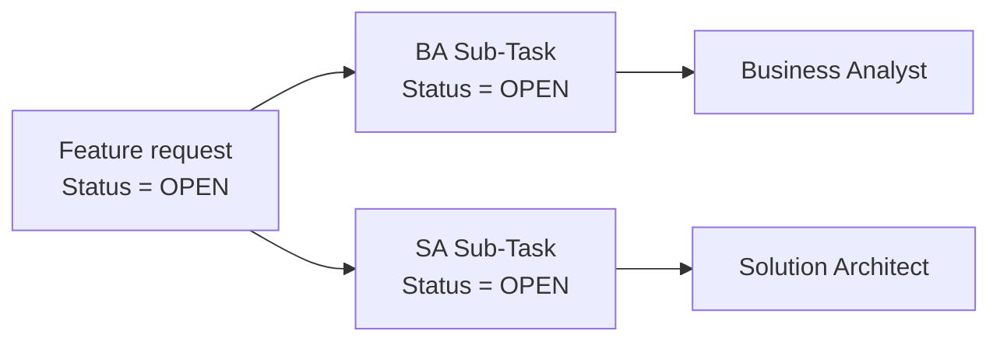

### Stage 3 - Requirements, acceptance criteria and scope refinement

Business Analyst and Solution Architect works in cooperation with Product Owner to limit scope of changes in terms of affected use cases, refines requirements, analyses impact on end-to-end business processes, identifies affected services and modules and so on.

During this stage new Use Case documentation created in Documentation (e.g. Confluence). "Developer Story" issues for implementation created in the tracking system (e.g. Jira) and linked to Documentation (e.g. Confluence) Use Cases. New Epics created to organize Developer Stories/Use Cases into valuable scenarios.

Most of work on this stage done by Business Analyst.

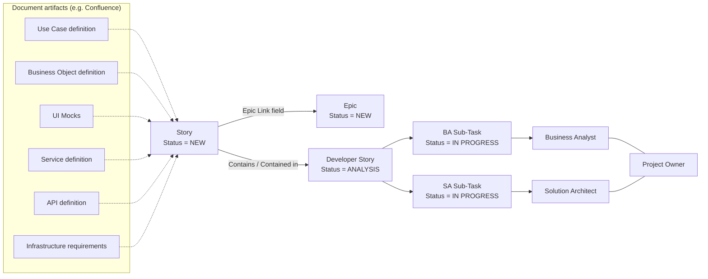

### Stage 4 - Preliminary analysis finished

Preliminary analysis finished, all artifacts developed and in place in Documentation (e.g. Confluence) and tracking system (e.g. Jira)

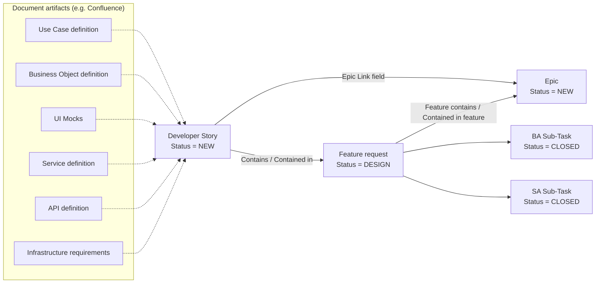

---

## Phase 3 - Design

### Stage 5 - Detailed design planned for next sprint

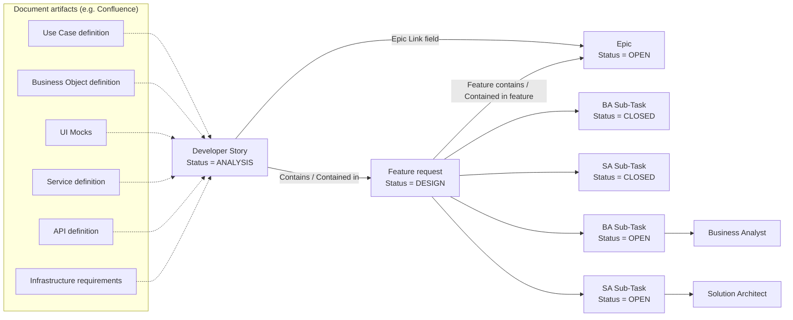

### Stage 6 - Detailed design in progress

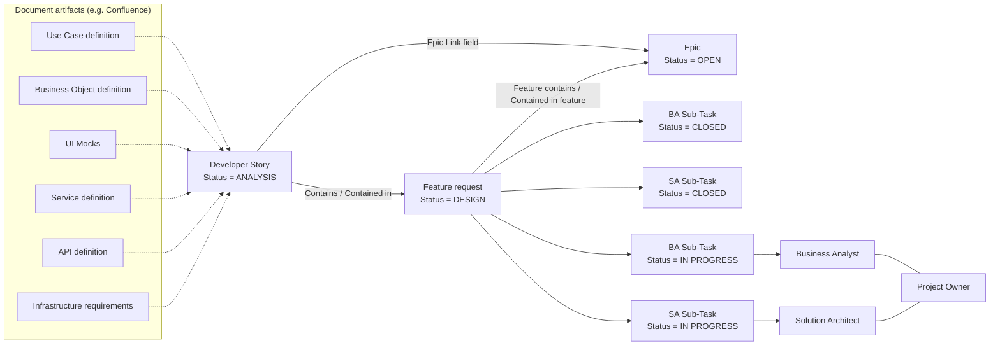

### Stage 7 - Detailed design done

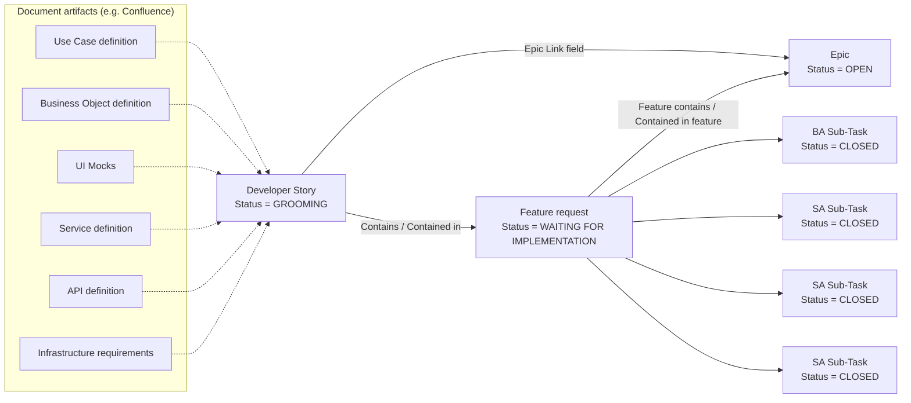

---

## Phase 4 - Implementation

### Stage 8 - Planning for implementation

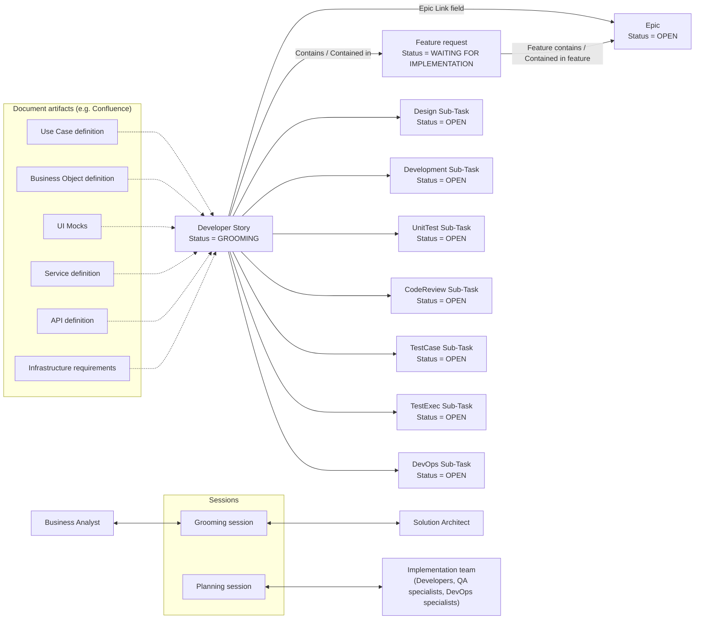

### Stage 9 - "Developer Story" estimated and ready for implementation

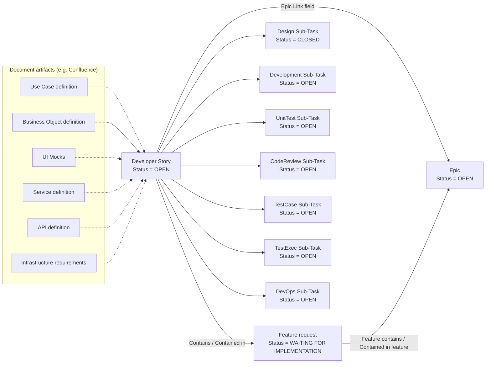

### Stage 10 - "Developer Story" implementation by developers, Test Cases design

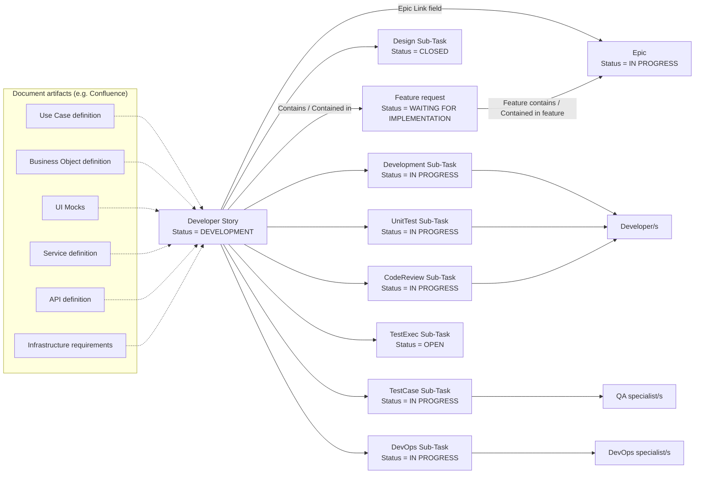

### Stage 11 - Testing and bug fixing

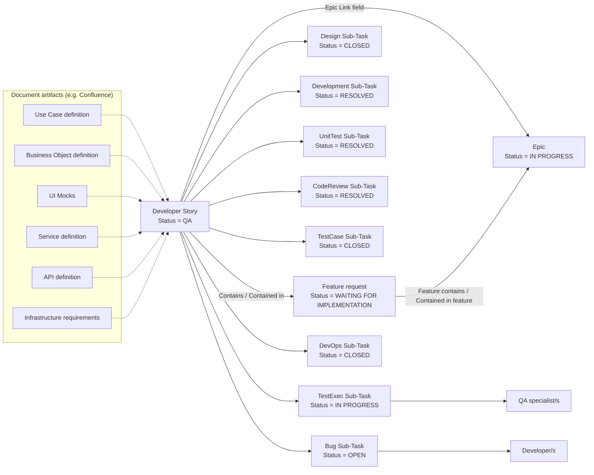

### Stage 12 - "Developer Story" implemented and ready for deployment

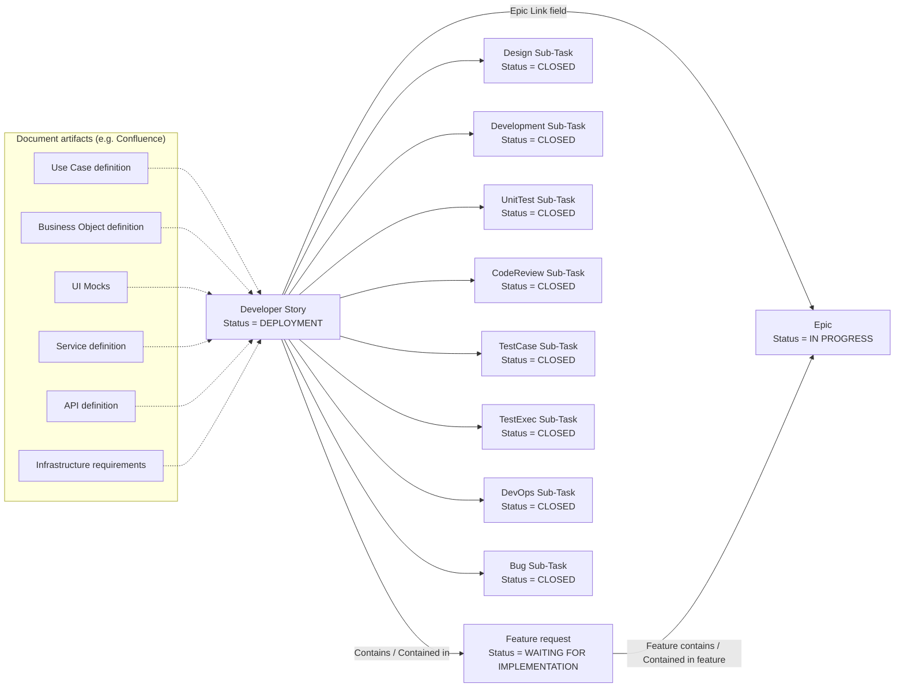

### Stage 13 - "Developer Story" deployed to User Acceptance Testing environment

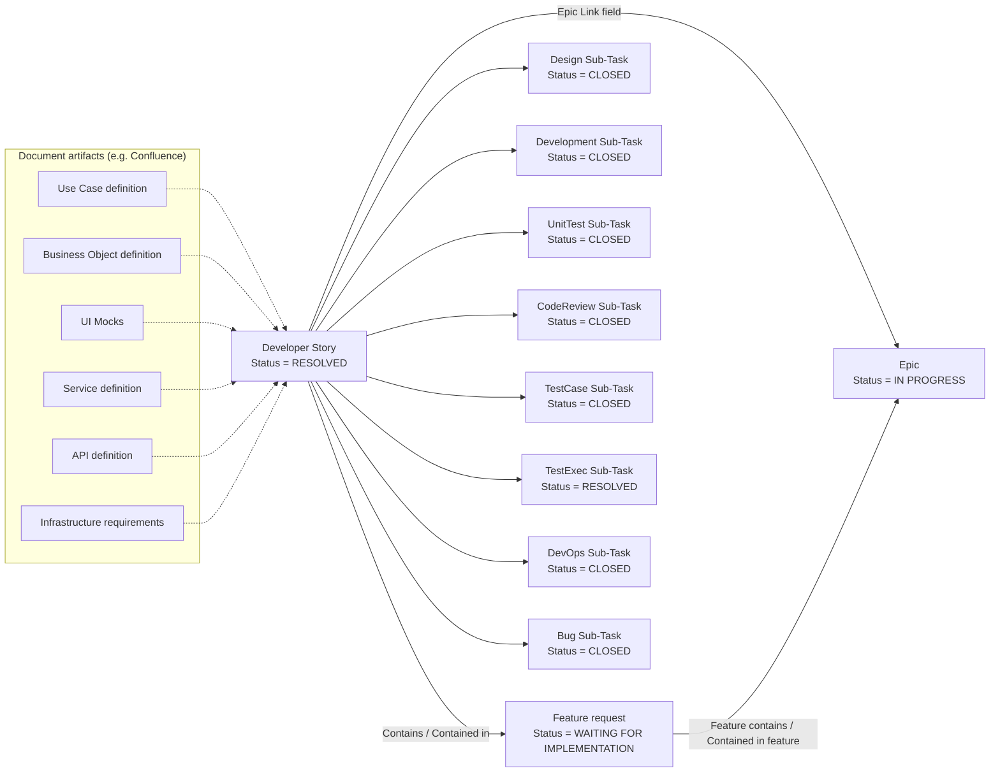

### Stage 14 - "Developer Story" deployed to Production environment

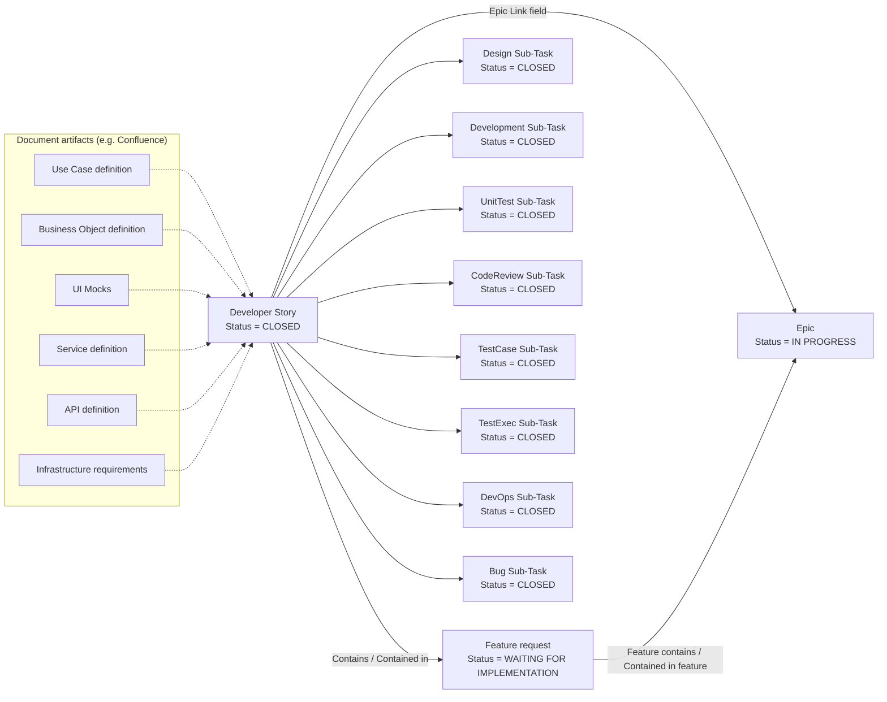

### Stage 15 - All "Developer Story" issues included in the Epic deployed to Production

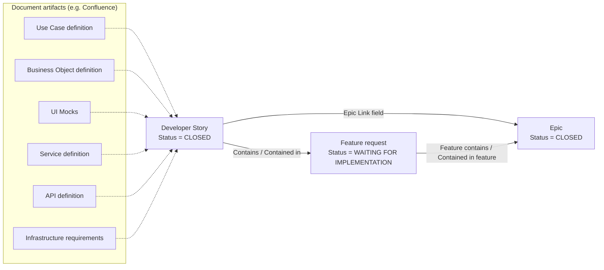

### Stage 16 - All Epics in the Feature request deployed to Production

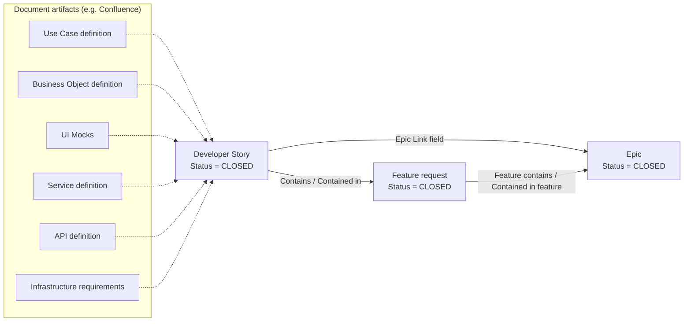
