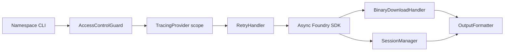

# DESIGN-005: Binary downloads, sessions, and tracing

| Field | Value |
|---|---|
| Document ID | DESIGN-005 |
| Status | Approved for implementation |
| Date | 2026-07-27 |
| Owner | Solution Architect |
| Story | DEV-STORY-004 |
| Decision source | QUESTION-027 |
| Related requirements | SRS-001 FR-DL, FR-SESSION, FR-TRACE |
| Related architecture | SAD-001, ADR-002, ADR-003, ADR-004, ADR-005, ADR-006 |

## 1. Scope

This design defines `BinaryDownloadHandler`, `SessionManager`, and `TracingProvider`. It resolves three SDK contract gaps:

- Binary responses may omit `Content-Length`, so the download limit must not depend on knowing the total size.
- AIP Agents sessions expose `Session.rid`, not a `session_token`.
- SDK context variables emit B3 multi-headers, not W3C Trace Context headers.

The components belong in `src/foundry_cli/common/`. Namespace scripts remain responsible for argument parsing and selecting the SDK operation.

## 2. Component relationships



Tracing surrounds the SDK call. Download and session handlers process successful SDK results. Errors continue through `ErrorSerializer`; operational metadata continues through `LogSetup` on stderr.

## 3. BinaryDownloadHandler

### 3.1 Interface

```python
@dataclass(frozen=True)
class DownloadResult:
    file_path: str
    file_size: int
    checksum_md5: str
    checksum_sha256: str
    mime_type: str | None
    truncated: bool
    source_size: int | None
    source_size_at_least: int | None

class BinaryDownloadHandler:
    async def save(
        self,
        chunks: AsyncIterable[bytes],
        *,
        original_filename: str | None,
        namespace: str,
        operation: str,
        content_length: str | None = None,
        content_encoding: str | None = None,
        mime_type: str | None = None,
    ) -> DownloadResult: ...
```

`file_size` is always the number of bytes stored. `source_size` is exact only when the handler reaches EOF or receives a valid non-negative `Content-Length` for an identity-encoded representation. Otherwise it is `null`. `source_size_at_least` is set only when truncation proves a lower bound but exact size remains unknown.

The JSON envelope keeps all existing fields and emits both additive size fields. Either field may be `null`. Readers must continue to accept older envelopes where these fields are absent.

### 3.2 Bounded streaming algorithm

1. Validate `max_download_bytes > 0` before opening a target file.
2. Create `<download-root>/<uuid>/` and sanitize the supplied filename to a basename. Use the documented fallback when no usable name remains.
3. Write to a same-directory temporary file opened for exclusive creation.
4. If a valid applicable `Content-Length` exceeds the limit, write and hash exactly the limit, then close the response without a probe.
5. Otherwise consume chunks until EOF or until `limit + 1` bytes have been observed. Write and hash no more than `limit` bytes.
6. If an extra byte is observed, set `truncated=true`, close the response iterator, and do not read to EOF.
7. Flush and `fsync` the temporary file, then publish it with `os.replace`.
8. Return checksums for the stored prefix only.

For an unknown-length response that ends at exactly the limit, the one-byte probe reaches EOF and `truncated=false`. For an unknown response larger than the limit, `source_size=null` and `source_size_at_least=limit + 1`.

### 3.3 Security and failure behavior

- Resolve the final path and require it to remain below the configured download root.
- Reject absolute names, parent traversal, separators, NUL bytes, and empty sanitized names.
- Do not retain the probe byte or calculate checksums over it.
- Remove the temporary file after cancellation, timeout, stream error, checksum error, or failed replacement.
- Never overwrite another download. UUID directory creation and temporary-file creation are exclusive.
- A valid `Content-Length` greater than the limit allows an early truncation warning, but the handler still stores the requested prefix.
- A missing, malformed, negative, compressed, or otherwise inapplicable `Content-Length` is treated as unknown.
- Adapters pass `content_length=None` when the SDK exposes no public response-header API. They must not depend on SDK private fields to recover it.

## 4. SessionManager

### 4.1 Persisted schema

```python
@dataclass
class SessionState:
    session_id: str
    agent_rid: str
    session_token: str | None
    created_at: str
    last_used_at: str
    status: Literal["active", "completed", "expired"]
    tool_history: list[dict[str, Any]]
```

`session_id` stores SDK `Session.rid`. `session_token` remains nullable for file-schema compatibility. New records write `null`; readers accept a missing key, `null`, or a string. Resume and continuation calls use `session_id` and `agent_rid` only. The implementation must not invent a token.

If a later SDK returns an opaque resume token, the same field may store it. A non-null value is secret and must never appear in logs or normal stdout.

### 4.2 Interface

```python
class SessionManager:
    async def create(
        self,
        alias: str,
        agent_rid: str,
        create_remote: Callable[[], Awaitable[Session]],
        delete_remote: Callable[[str], Awaitable[None]] | None = None,
    ) -> SessionState: ...

    def load(self, alias: str) -> SessionState: ...
    def update(self, alias: str, state: SessionState) -> None: ...
    def purge(self) -> int: ...
    def cleanup_expired(self, now: datetime) -> int: ...
```

Aliases are normalized with Unicode NFKC, trimmed, case-folded, and have whitespace runs collapsed to `-`. The canonical value must be one alphanumeric character or match `[a-z0-9][a-z0-9._-]{0,62}[a-z0-9]`. Reject separators, controls, non-ASCII residue, `.`/`..`, and Windows reserved names. File names are derived only from the canonical alias.

### 4.3 Atomicity and concurrency

- Acquire a cross-process alias lock with `fcntl.flock` on Unix and `msvcrt.locking` on Windows before checking or creating a session. Persistent lock files are allowed because the OS releases locks when a process exits.
- Recheck alias state while holding the lock. An active record causes `SessionAliasConflictError`.
- Write JSON to a same-directory temporary file, flush, `fsync`, apply restrictive permissions, then use `os.replace`.
- Release locks in `finally`; do not infer lock ownership from stale file contents.
- Cleanup and purge acquire each alias lock before mutation. They skip a currently locked alias and log a warning.
- If remote creation succeeds but local persistence fails, attempt `delete_remote(session.rid)` once. Preserve the original persistence error and include the RID in structured diagnostic metadata if compensation also fails.
- Corrupt JSON, schema mismatches, invalid statuses, and invalid timestamps produce a warning without token content. Delete the invalid record while holding the alias lock, then treat the alias as absent.

On Unix, files use mode `0o600` and directories use `0o700`. On Windows, the implementation uses owner-restricted ACLs when available and logs a warning when it cannot enforce them.

## 5. TracingProvider

### 5.1 SDK-native B3 contract

The installed SDK reads these exact context variables and environment variables:

| SDK variable | Environment variable | HTTP header |
|---|---|---|
| `TRACE_ID_VAR` | `FOUNDRY_TRACE_ID` | `X-B3-TraceId` |
| `SPAN_ID_VAR` | `FOUNDRY_SPAN_ID` | `X-B3-SpanId` |
| `SAMPLED_VAR` | `FOUNDRY_SAMPLED` | `X-B3-Sampled` |

This is B3 multi-header propagation. It is not W3C `traceparent` or `tracestate` propagation.

Generated values use lowercase hexadecimal: 32 characters for a 128-bit trace ID, 16 characters for a 64-bit span ID, and `"0"` or `"1"` for sampled. Caller-supplied values must pass the same validation.

### 5.2 Interface and isolation

```python
@dataclass(frozen=True)
class B3Context:
    trace_id: str
    span_id: str
    sampled: str

class TracingProvider:
    @contextmanager
    def scope(self, supplied: B3Context | None = None) -> Iterator[B3Context | None]: ...
```

When tracing is disabled, `scope()` yields `None` and does not alter SDK context. When enabled, it sets all three SDK `ContextVar` values, retains their reset tokens, and restores prior values in `finally`. This prevents trace leakage across async tasks, retries, tests, and sequential CLI operations.

Trace IDs and span IDs may be logged as correlation metadata. They are not credentials. The provider must not log request bodies, bearer tokens, session tokens, or response content.

## 6. Integration order

1. Load and validate configuration.
2. Configure logging and run expired-session cleanup once for every CLI invocation.
3. Parse operation input and run `AccessControlGuard` before any SDK call or operation-specific filesystem mutation.
4. Enter `TracingProvider.scope()` before constructing the SDK client.
5. Construct the client, then invoke the SDK through `RetryHandler` and the configured timeout while the trace scope remains active.
6. Pass a successful binary stream to `BinaryDownloadHandler`, or a successful AIP Agents `Session` to `SessionManager`.
7. Exit tracing scope, restoring prior SDK context.
8. Serialize the result through `OutputFormatter`; write logs and warnings to stderr.
9. Map failures through `ErrorSerializer` without exposing secrets or partial temporary paths.

Session alias locking starts after access control and before remote session creation. Binary publication occurs only after the stream operation succeeds or reaches the intentional truncation boundary.

## 7. Test matrix

| Area | Case | Expected result |
|---|---|---|
| Download | Known length below limit | Full file; `truncated=false`; exact `source_size` |
| Download | Known length above limit | Exactly limit bytes; `truncated=true`; exact header-derived `source_size` |
| Download | Unknown length below limit | EOF; exact counted `source_size` |
| Download | Unknown length exactly at limit | Probe reaches EOF; `truncated=false` |
| Download | Unknown length above limit | Limit bytes; one-byte probe; `source_size=null`; lower bound set |
| Download | Malformed or compressed length | Treat size as unknown |
| Download | Traversal or absolute filename | Reject before file creation |
| Download | Stream error or cancellation | No published file; temporary file removed |
| Download | Concurrent downloads with same name | Separate UUID directories; no overwrite |
| Session | SDK `Session.rid` returned without token | Persist RID as `session_id`; write token as `null` |
| Session | Legacy file omits or contains token | Load both forms; resume ignores token |
| Session | Concurrent create for same alias | One success; one conflict; one remote create only |
| Session | Persistence fails after remote create | Compensation attempted; original error retained |
| Session | Corrupt state file | Warn without secrets, delete under alias lock, and treat alias as absent |
| Session | Expired cleanup races with update | Alias lock prevents partial or lost update |
| Tracing | Disabled | No SDK context mutation |
| Tracing | Generated context | Valid 128-bit trace ID, 64-bit span ID, sampled value |
| Tracing | Nested or failed scope | Prior values restored in all exit paths |
| Tracing | Concurrent async tasks | No context leakage between tasks |
| Integration | Retry within tracing scope | Every attempt carries same B3 context |
| Integration | Error serialization | No token, body, content, or temporary path leakage |

Tests must run on Python 3.11 and 3.12. Filesystem tests must cover Windows and Unix behavior; permission assertions may be platform-specific.

## 8. Estimates

| Work item | Estimate |
|---|---:|
| Design and contract finalization | 0.5 engineering day |
| Shared-component implementation | 2.5 engineering days |
| Unit tests | 1.25 engineering days |
| Code review | 0.5 engineering day |
| QA test design and execution | 1.0 engineering day |
| Packaging and CI readiness | 0.25 engineering day |
| Total | 6.0 engineering days / 48 hours |

Story estimate is 13 points. Work fits one sprint because QA test design and packaging readiness can overlap implementation. Estimate assumes existing configuration, retry, logging, formatting, and error components remain stable. Changes to public CLI arguments or support for W3C Trace Context require separate design review.

## 9. Definition of done

- All interfaces and behaviors in this document are implemented without changing existing required envelope fields.
- Test matrix passes on supported Python versions and operating systems.
- No unbounded response read occurs after the download limit is crossed.
- Session files remain readable across missing, null, and string `session_token` forms.
- Tracing emits only SDK-native B3 headers and restores SDK context after every call.
- SRS, SAD, and document index remain consistent with this design.
