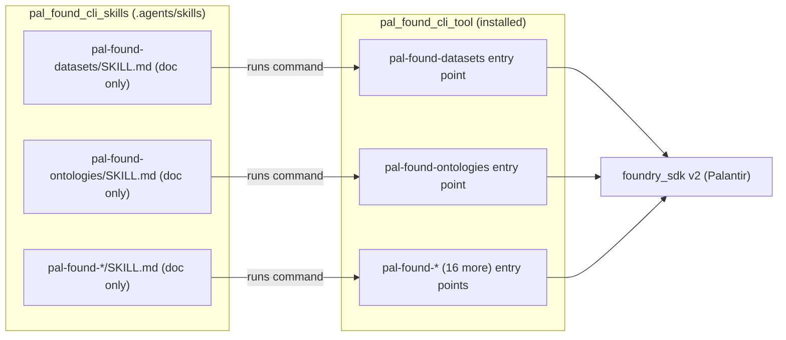

# Architecture Analysis — SA-ANA-012

## Remove Python Scripts from Skills, Retire the Launcher Layer, Migrate Datasets/Ontologies Implementations to the Tool

| Field | Value |
| --- | --- |
| **Document ID** | SA-ANA-012 |
| **Feature** | FEATURE-011 |
| **Status** | Resolved — pending Project Owner approval |
| **Date** | 2026-09-30 |
| **Author** | Solution Architect |
| **Requirement source** | Project Owner change request 2026-09-30 (FEATURE-011) |

---

## 1. Affected Components Inventory

The change touches three repositories and three layers.

### 1.1 Skills repository (`pal_found_cli_skills`) — skill folders

The `.agents/skills/` tree distributes 19 folders. One (`pal-found`) is already a
documentation-only knowledge skill with no executable code. The remaining 18
namespace skills each carry a `scripts/` layer:

| Skill folder | Script | Kind (measured 2026-09-30) |
| --- | --- | --- |
| `pal-found-admin` | `scripts/pal_found_admin_cli.py` | Thin launcher |
| `pal-found-aip-agents` | `scripts/pal_found_aip_agents_cli.py` | Thin launcher |
| `pal-found-audit` | `scripts/pal_found_audit_cli.py` | Thin launcher |
| `pal-found-checkpoints` | `scripts/pal_found_checkpoints_cli.py` | Thin launcher |
| `pal-found-connectivity` | `scripts/pal_found_connectivity_cli.py` | Thin launcher |
| `pal-found-data-health` | `scripts/pal_found_data_health_cli.py` | Thin launcher |
| `pal-found-datasets` | `scripts/pal_found_datasets_cli.py` (526 lines) | Standalone duplicate |
| `pal-found-filesystem` | `scripts/pal_found_filesystem_cli.py` | Thin launcher |
| `pal-found-functions` | `scripts/pal_found_functions_cli.py` | Thin launcher |
| `pal-found-language-models` | `scripts/pal_found_language_models_cli.py` | Thin launcher |
| `pal-found-media-sets` | `scripts/pal_found_media_sets_cli.py` | Thin launcher |
| `pal-found-models` | `scripts/pal_found_models_cli.py` | Thin launcher |
| `pal-found-ontologies` | `scripts/pal_found_ontologies_cli.py` (503 lines) | Standalone duplicate |
| `pal-found-orchestration` | `scripts/pal_found_orchestration_cli.py` | Thin launcher |
| `pal-found-sql-queries` | `scripts/pal_found_sql_queries_cli.py` | Thin launcher |
| `pal-found-streams` | `scripts/pal_found_streams_cli.py` | Thin launcher |
| `pal-found-third-party-applications` | `scripts/pal_found_third_party_applications_cli.py` | Thin launcher |
| `pal-found-widgets` | `scripts/pal_found_widgets_cli.py` | Thin launcher |

The launcher scripts are thin wrappers (10-26 lines) that walk up the directory
tree to locate `src/pal_found_cli/`, push it onto `sys.path`, and re-export
`build_parser`, `console_main`, `main` from the packaged module. Datasets and
ontologies instead carry full standalone copies of the command parser and
dispatch logic.

### 1.2 Launcher layer (`scripts/` in skill folders)

Sixteen skills keep behavior entirely in the packaged module and only proxy to
it from the launcher. Datasets and ontologies embed behavior directly in the
skill copy. Under the doc-only model this `scripts/` layer is retired entirely:
no skill folder retains a `scripts/` directory.

### 1.3 Tool repository (`pal_found_cli_tool`) — console entry points

The tool owns the canonical command implementations. `pyproject.toml`
`[project.scripts]` exposes 18 `pal-found-*` commands, each mapping to a
packaged module target. Datasets and ontologies are already present and
verified as supersets:

| Entry point | Target | Operations (measured 2026-09-30) |
| --- | --- | --- |
| `pal-found-datasets` | `pal_found_cli.datasets.scripts.pal_found_datasets_cli:main` | 33 across 5 resource clients |
| `pal-found-ontologies` | `pal_found_cli.ontologies.scripts.pal_found_ontologies_cli:console_main` | 67 canonical operations |
| `pal-found-filesystem` … `pal-found-widgets` | `pal_found_cli.<ns>.scripts....:console_main` | 16 remaining namespaces |

### 1.4 Verification of the BA's superset finding (BA-ANA-012)

BA-ANA-012 asserted the tool implementations are supersets of the stale skill
copies. Measured on 2026-09-30 the tool files are materially larger and the
parser catalogs are broader:

| Source | Datasets | Ontologies |
| --- | --- | --- |
| Tool (`pal_found_cli_tool/src/pal_found_cli/...`) | 732 lines, 33 ops | 1,225 lines, 67 ops |
| Skill copy (`.agents/skills/.../scripts/`) | 526 lines | 503 lines |

Exact line counts differ slightly from BA-ANA-012's figures (different
snapshots), but the conclusion is the same: the tool owns larger, more complete
implementations and its operation catalog covers the skill copies. Migration is
therefore a removal of duplicate skill copies, not a net-new tool command.

## 2. Out of Scope

Palantir-owned identifiers (`foundry_sdk`, `foundry-platform-sdk`,
`FOUNDRY_TOKEN`, `FOUNDRY_HOSTNAME`) stay unchanged. No change to SDK contract,
auth, access control, output formats, exit codes, retry, or tracing behavior.
FEATURE-011 is a content-model and packaging change, not an SDK or API change.

## 3. Architecture Approach — the Doc-Only Skill Model

Each namespace skill becomes a single `SKILL.md` that documents the skill's
purpose and the operations it covers, and invokes the installed `pal-found-*`
command by name. The tool is the single source of command behavior.

Key constraints that make the model mechanical and verifiable:

- One canonical naming source. The 18 `pal-found-*` entry points (BA-ANA-010,
  ND-010-03) already match the 18 namespace skill folders, so each `SKILL.md`
  invokes the command whose name matches its folder.
- No behavior duplication. Command logic lives once, in the tool. Skills carry
  no executable code and no interpreter/path walk.
- No Python knowledge. Agents run `pal-found-<ns> <resource> <operation> ...`
  as installed commands; no `sys.path` manipulation, no launcher resolution.
- Tool install is the dependency. A doc-only skill is unusable without the
  installed tool, so onboarding and every `SKILL.md` must state the prerequisite
  (BR-011-05 assumption in BA-ANA-012). Each `SKILL.md` must also note the
  dependency on the installed `pal_found_cli` package and give a short,
  concise install instruction per package manager (conda, PyPI/pip, uv) so an
  agent or adopter can bootstrap the command surface in one step.

### 3.1 Component/sequence view

The `scripts/` launcher layer is removed from the flow entirely; every skill
arrow points straight at an installed entry point.

### 3.2 Retiring the launcher layer

The 16 thin launchers proxy to the packaged module and add no behavior. Their
removal changes nothing at the command level: the same operations remain
available because the packaged entry points are installed with the tool. The
only requirement is that the `SKILL.md` usage text stop referencing a
`python ..._cli.py` path and reference `pal-found-<ns>` instead.

### 3.3 Datasets and ontologies migration

Datasets and ontologies are the two skills whose skill folders carry full copies
of the implementation rather than thin wrappers. Because the tool already owns
canonical `pal-found-datasets` (33 ops) and `pal-found-ontologies` (67 ops)
implementations that are verified supersets, the migration is:

1. Remove the stale `scripts/` copies from the datasets and ontologies skill
   folders.
2. Verify the tool command surface covers the same operations (done for this
   analysis; the tool catalogs are larger).
3. Update each `SKILL.md` to invoke `pal-found-datasets` / `pal-found-ontologies`.
4. No new tool command is required.

This preserves behavior per BR-011-06 because the tool copy is the authoritative
implementation.

### 3.4 Package-manager install prerequisite for doc-only skills

Because a doc-only skill ships no executable code, its entire command surface
comes from the installed tool. Every namespace `SKILL.md` depends on the
`pal_found_cli` package being present and therefore carries a short, concise
install instruction per package manager. The package is published to the two
channels established by EPIC-010, plus a uv-compatible path:

| Package manager | Command | Notes |
| --- | --- | --- |
| conda | `conda install -c t-jet pal_found_cli` | anaconda.org `t-jet` channel (SA-ANA-005 / EPIC-010) |
| PyPI / pip | `pip install pal_found_cli` | PyPI distribution (SA-ANA-004 / EPIC-010) |
| uv | `uv tool install pal_found_cli` (or `uv pip install pal_found_cli` in an active env) | uv front-end over the same PyPI distribution |

These are the exact, single-line instructions each `SKILL.md` should state next
to its `pal-found-*` usage examples, mirroring the BA-ANA-012 onboarding
 prerequisite. This keeps the skill self-contained and verifiable without
 coupling the skill text to any interpreter, launcher path, or vendored copy.

## 4. Technology Stack

The technology stack is unchanged by FEATURE-011.

- Python 3.11+ packaging via setuptools / PEP 517 (`pal_found_cli` distribution).
- `pal-found-*` console entry points as the public command interface.
- `foundry-platform-sdk>=1.0.0`, `python-dotenv`, `requests` runtime deps.
- pytest / pytest-cov / mypy / ruff / bandit gates in CI.
- GitHub Actions (`ci.yml`, `publish.yml`) for automated distribution.
- Pip, conda (`t-jet` channel), and uv as installation paths for `pal_found_cli`
  (EPIC-010); each `SKILL.md` cites the matching install command.

The change is to what ships in the skills repository, not to the runtime stack.
No new runtime or build dependencies.

## 5. Non-Functional Requirements

| Category | Requirement |
| --- | --- |
| Maintainability | Command logic exists in exactly one place (the tool); skills are doc-only and human-maintainable. |
| Usability | Using a skill requires no Python knowledge and no launcher path resolution. |
| Compatibility | All 18 `pal-found-*` commands remain installed and callable with unchanged behavior. |
| Consistency | `SKILL.md` command examples never reference `python ..._cli.py` (AC-011-02). |
| Distribution | Skills distribute as documentation only; copy instructions carry no executable code (AC-011-06, AC-011-01). Each `SKILL.md` states the `pal_found_cli` dependency and a per-manager install instruction (conda/pip/uv). |
| Security | No auth, credential, or access-control changes; ADR-007 applies unchanged to installed commands. |
| Performance | No change to Foundry request volumes or transfer sizes (BA-ANA-012 §10-11). |

## 6. General Implementation Approach

1. Sweep the 18 namespace `SKILL.md` files; rewrite invocation text from
   `python ..._cli.py` to `pal-found-<ns>` and remove any `scripts/` references.
2. Remove the `scripts/` directory from all 18 namespace skill folders,
   including the datasets and ontologies standalone copies.
3. Verify the tool command surface for datasets/ontologies covers the removed
   copies' operations (superset confirmed; no new command).
4. State the tool-install prerequisite in each `SKILL.md` and in onboarding,
   including the short per-package-manager install command (conda `-c t-jet`,
   `pip install pal_found_cli`, `uv tool install pal_found_cli`).
5. Re-run the skills-repo test suite and markdown lint (AC-011-01..AC-011-07).
6. Update the DESIGN/DEVOPS/TESTCASE/TESTEXEC deliverables that reference the
   launcher pattern and register the change in `document_index.md`.

## 7. General Migration and Rollback Approach

Migration is phased and reversible:

- Phase 1 — Docs: rewrite all 18 `SKILL.md` invocation text; update onboarding
  and DESIGN/QA references to the doc-only model.
- Phase 2 — Remove `scripts/`: delete the launcher and standalone-copy
  directories from the skills repo; verify no code references remain.
- Phase 3 — Verify: run the skills test suite, markdown lint, and confirm every
  `SKILL.md` cites an installed `pal-found-*` command.

Rollback: the skills repository keeps a clean git history, so reverting is a
restore of the deleted `scripts/` folders and `SKILL.md` text from the prior
release tag. No tool-side changes are required for rollback because the tool is
untouched. Because command behavior is sourced only from the tool, rollback of
the skill content does not affect installed command availability.

## 8. Risks and Dependencies

| Item | Risk | Mitigation |
| --- | --- | --- |
| Tool install missing | Doc-only skill loaded without the tool leaves commands unavailable (BA-ANA-012 §9) | Clear prerequisite statement plus a per-manager install command (`conda install -c t-jet pal_found_cli`, `pip install pal_found_cli`, `uv tool install pal_found_cli`) in every `SKILL.md` and onboarding |
| Stale invocation text | A retained `python ..._cli.py` example persists after the change | AC-011-02 sweep of all 18 `SKILL.md` files; markdown/CI gate |
| Datasets/ontologies drift | Tool copy lagging behind the removed skill copy | Superset verified at analysis; behavior parity confirmed in QA; tool is the single source |
| Docs/structure misalignment | DESIGN/DEVOPS/TESTCASE/TESTEXEC still describe the launcher pattern | Reference sweep in the migration phase; `document_index.md` updated |
| Downstream designs | EPIC-009/010 release and distribution docs assume the current model | Impact noted in `document_index.md` and via this analysis deliverable |

Dependencies: FEATURE-011 creates EPIC-011 at design start (BR-011-07); the
design (BA-DES/SA-DES) and DEV stories build the doc-only model from the start.
The tool must already be installed for skills to function, which chains on
EPIC-010 distribution.

## 9. Coordination with BA and Project Owner

- BA-ANA-012 completed the business analysis (deliverable
  `BA-ANA-012-doc-only-skills.md`) and confirmed the affected skill inventory,
  the doc-only model, and the superset finding for datasets/ontologies.
- SA-ANA-012 confirms the BA's architecture-level findings independently and
  adds the launcher-retirement design, NFRs, migration/rollback, and risks.
- The SA analysis resolves QUESTION-141 (architect to progress SA-ANA-012),
  which unblocks BA-ANA-012's Resolved→Closed progression.
- FEATURE-011 advances to In Design only when both analysis sub-tasks are
  Closed; the doc-only model then underpins the design phase.
- Project Owner change request (QUESTION-149) requires each `SKILL.md` to note
  the `pal_found_cli` package dependency and provide short per-package-manager
  install instructions (conda/PyPI/uv), incorporated in §3.4, §4, §5, §6, §8.
- The BA cross-review (QUESTION-142) validates this analysis against the BA
  business requirements and the same install-alignment guidance.

## 10. Traceability

| Artifact | Reference |
| --- | --- |
| Feature | FEATURE-011 (Analysis, Project Owner change request 2026-09-30) |
| BA sub-task | BA-ANA-012 (`BA-ANA-012-doc-only-skills.md`) |
| SA sub-task | SA-ANA-012 (this deliverable) |
| Epic | EPIC-011 (created at design start, linked via FeatureContains) |
| Related analysis | SA-ANA-010 (naming ND-010-03), SA-ANA-002..009 |
| Related docs | `document_index.md`, SAD-001, ADRs 001-007, canonical-env-var-reference, metadata-allow-list |
| Distribution surface | `pyproject.toml` `[project.scripts]`, `pal_found_cli_skills/.agents/skills` |
