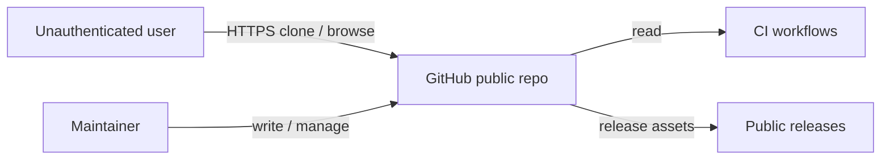

# Technical Design — SA-DES-002

## Host All Three Repositories Publicly on GitHub

| Field | Value |
| --- | --- |
| **Document ID** | SA-DES-002 |
| **Feature** | FEATURE-002 |
| **Status** | In Progress |
| **Date** | 2026-08-13 |
| **Author** | Solution Architect |
| **Based on** | BA-DES-002 (business design), SA-ANA-002, BA-ANA-002 (analysis, Closed, PO-approved) |
| **Requirement source** | Project Owner architecture-change request 2026-08-11 |

## 1. Scope

Make three repositories publicly visible and cloneable on GitHub: `pal_found_cli`
(design, documentation, tracking), `pal_found_cli_tool` (CLI source), and
`pal_found_cli_skills` (agent skills). Names follow ND-010-01 (CONFIRMED,
QUESTION-072 Closed 2026-08-12, mapping rows 1-3 of SA-ANA-010). This design
covers the technical procedure, verification, and rollback for the visibility
change. It assumes FEATURE-003 (repository split) landed first: three separate
repositories must exist before they can be made public.

## 2. API and Interface Changes

No application interfaces change. The CLI, SDK bindings, and access-control
behaviour are untouched. The change affects GitHub platform surfaces only:

| Surface | Before | After |
| --- | --- | --- |
| Repository visibility | private | public (read open) |
| Git clone protocol | credentials required | anonymous read allowed |
| Web browsing (README, files, issues, PRs) | login required | open |
| Releases and tags | internal | publicly reachable |
| Write access | maintainers | unchanged, maintainers only |
| GitHub Actions (ci.yml, publish.yml) | unchanged | unchanged, secrets scoped per repo |
| GitHub REST API (verification probes) | not used | used by the publication checklist |

Verification uses standard git and GitHub REST calls: anonymous clone, unauthenticated
GET of repo metadata, release assets download, and issues/PRs listing. No code change
is required in the tool.

## 3. Architecture Approach per Use Case

- UC-1 Public read: visibility set to public at repository level. Anonymous HTTPS
  clone and browse work for all three repos. Branch protection rules stay active.
- UC-2 Restricted write: write permission remains limited to maintainers and
  approved collaborators per repository. No shared credentials.
- UC-3 External contributions: issues and pull requests open to visitors. A
  contribution guide defines expected behaviour; maintainers review and merge.
- UC-4 Public releases: tags and release assets inherit repository visibility.
  No separate release ACL exists.
- UC-5 Reversibility: switching visibility back to private cuts all public access
  immediately; git and web surfaces both close.
- UC-6 Secret safety: a scan gate runs before the flip. `.env`, token files, and
  internal-only material are excluded or removed; GitHub secret scanning stays on.

## 4. Non-functional Requirements for Developers

| NFR | Requirement |
| --- | --- |
| SEC-1 | No secrets, credentials, or private customer data in any public repository; scan before and after publication |
| SEC-2 | `.env` and local state files stay gitignored; never committed |
| SEC-3 | Write access restricted to maintainers; branch protection enforced |
| AVAIL-1 | Public read path available 24x7 via GitHub; no self-hosted dependency |
| REV-1 | Visibility change reversible within minutes; rollback documented |
| ACC-1 | Permission model configured independently per repository |
| OBS-1 | Publication and verification outcomes recorded in the publication checklist |

## 5. Infrastructure Changes

- Repository visibility setting switched to public on the three repositories.
- Branch protection rules confirmed per repo (main branch, required reviews).
- GitHub secrets scope reviewed per repo; no cross-repo secrets.
- CODEOWNERS and contribution guide added where absent.
- Secret scanning and push protection enabled on all three repositories.
- No new services, no new runtime dependencies.

## 6. Migration Procedure

1. Freeze content changes in each repository one day before publication.
2. Run the secret scan and content review on all three repositories; fix and
   re-scan until clean. Record results in the publication checklist.
3. Publish one repository at a time in dependency order: `pal_found_cli_skills`
   first (no internal dependencies), then `pal_found_cli_tool`, then
   `pal_found_cli`.
4. After each publication run the verification pass: anonymous clone without
   credentials, browse repo page without login, list issues and PRs, download a
   release asset without login.
5. Confirm write access and branch protection remain restricted to maintainers.
6. Announce the publication and point users at the canonical URLs used by the
   distribution channels (FEATURE-004, FEATURE-005, FEATURE-007).
7. Rollback: if any verification fails, switch the repository back to private,
   document the reason, and resume after the fix.

## 7. Risks and Mitigations

| Risk | Mitigation |
| --- | --- |
| Secret exposure | Pre-publication audit, secret scanning, gitignore enforcement (SEC-1, SEC-2) |
| Unwanted contributions | Contribution guide and maintainer review gates |
| Split not complete | Sequence FEATURE-003 first, then publish (dependency order) |
| Verification gap | Repeat the anonymous checks per repository after each flip |
| Broken references | Confirm documentation links use the final public URLs |

## 8. Traceability

| Artifact | Reference |
| --- | --- |
| Feature | FEATURE-002 |
| Epic | EPIC-010 |
| BA design sub-task | BA-DES-002 (In Progress) |
| SA design sub-task | SA-DES-002 |
| Analysis | BA-ANA-002, SA-ANA-002 (Closed, PO-approved) |
| Business design | BA-DES-002-business-design.md |
| Rename mapping | SA-ANA-010 rows 1-3 (ND-010-01, QUESTION-072 Closed) |
| Related features | FEATURE-003 (prerequisite), FEATURE-004/005/007 (consumers) |
