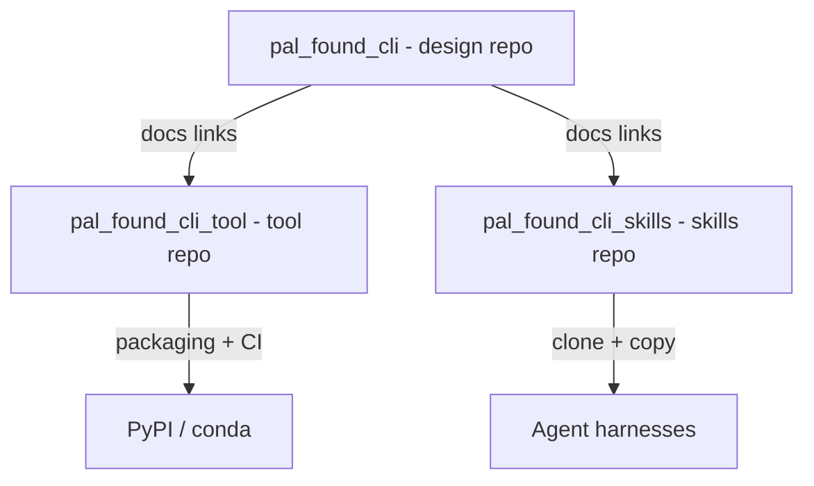

# Technical Design — SA-DES-003

## Split the Project into Three Repositories

| Field | Value |
| --- | --- |
| **Document ID** | SA-DES-003 |
| **Feature** | FEATURE-003 |
| **Status** | In Progress |
| **Date** | 2026-08-13 |
| **Author** | Solution Architect |
| **Based on** | BA-DES-004 (business design), SA-ANA-003, BA-ANA-004 (analysis, Closed, PO-approved) |
| **Requirement source** | Project Owner architecture-change request 2026-08-11 |

## 1. Scope

Split the combined repository into three independent repositories per ND-010-01
(CONFIRMED, QUESTION-072 Closed): `pal_found_cli` (design, docs, tracking),
`pal_found_cli_tool` (CLI source, tests, packaging, CI), and `pal_found_cli_skills`
(agent skills). Each repository gets its own version history and release cadence.
The split is the structural prerequisite for FEATURE-002 (public hosting) and the
distribution features.

## 2. API and Interface Changes

No application interfaces change. Repository-level surfaces change:

| Surface | Before | After |
| --- | --- | --- |
| Repository URLs | single combined repo | three URLs: `pal_found_cli`, `pal_found_cli_tool`, `pal_found_cli_skills` |
| Submodule registration | `foundry_cli_tool`, `foundry_cli_skills` in parent `.git/config` + `.gitmodules` | submodule URLs updated to `t-jet/pal_found_cli_tool.git`, `t-jet/pal_found_cli_skills.git` (mapping row 4) |
| `.claude/skills` (19 folders) | in design repo | moved to skills repo under `.agents/skills` (FEATURE-006) |
| `src/foundry_cli`, `tests`, `pyproject.toml` | in design repo | moved to tool repo |
| `.ept` docs and tracker | in design repo | stay in design repo |
| GitHub Actions workflows | in design repo | reproduced per repo (tool and skills) |
| Cross-repository references | relative links inside one repo | explicit pointers: absolute GitHub URLs, tags, release notes |

## 3. Architecture Approach per Use Case

- UC-1 Content classification: every top-level item maps to exactly one ownership
  group (design, tool, skills) before any move. The mapping is written down and
  reviewed before execution.
- UC-2 History-preserving moves: `git filter-repo` carries history for content that
  moves; clean moves are used where history is not required. Each move lands as
  reviewable commits.
- UC-3 Cross-repository references: documentation links into the tool or skills
  repos become absolute GitHub URLs; in-repo links stay relative. Version coupling
  is expressed through tags and release notes, not shared files.
- UC-4 CI reproduction: the tool repo receives the full pipeline (lint, type-check,
  test, security, build); the skills repo receives a minimal content-validation
  pipeline.
- UC-5 Promotion: the nested repos become standalone repositories; the split
  completes before visibility changes (FEATURE-002).

## 4. Non-functional Requirements for Developers

| NFR | Requirement |
| --- | --- |
| TRA-1 | Every moved item traceable to its source commit; history preserved where required |
| REP-1 | Tool repo builds reproduce from a clean checkout; full suite green after the move |
| REF-1 | No broken cross-repository reference; verified by a reference sweep |
| INT-1 | Content integrity: each repo contains only its own content type |
| SEC-1 | No secrets move with content; scan after each move |
| DOC-1 | Repository entry points (README, issue templates, contribution guide) updated |

## 5. Infrastructure Changes

- Create/rename the three repositories to the confirmed names.
- Update submodule URLs in parent `.git/config` and `.gitmodules` (row 4); update
  local remotes; GitHub redirects keep old URLs resolving.
- Reproduce the CI/CD pipeline in the tool repo; add a minimal pipeline to the
  skills repo.
- Keep the old combined layout read-only until the consistency check passes.
- No new services, no new runtime dependencies.

## 6. Migration Procedure

1. Build the content classification record; confirm every item has exactly one
   ownership group.
2. Create the three target repositories with the confirmed names.
3. Move content per repository: design and tracking into `pal_found_cli`; CLI
   source, tests, and packaging into `pal_found_cli_tool`; skill folders into
   `pal_found_cli_skills`, carrying history with the move.
4. Update the reference register: rewrite cross-repository links to the new
   locations and remove stale references.
5. Run the consistency check (content type per repo, references resolve) and fix
   discrepancies.
6. Reproduce the CI pipeline in the tool repo and run the full test suite there.
7. Retire the old combined layout as the working home and repoint workflow entry
   points at the three new repositories.
8. Rollback: keep the old repository read-only until the consistency check passes
   so content can be recovered if the split fails.

## 7. Risks and Mitigations

| Risk | Mitigation |
| --- | --- |
| Wrong classification | Written content map reviewed before the move (UC-1) |
| Broken references | Reference sweep after the move; AC-D-004-05 verified per link |
| History loss | `git filter-repo` for history-preserving moves (UC-2) |
| CI drift | Reproduce pipeline in the tool repo before removing source from the design repo (UC-4) |
| Submodule breakage | Update `.gitmodules` and local remotes together; verify fresh clones |

## 8. Traceability

| Artifact | Reference |
| --- | --- |
| Feature | FEATURE-003 |
| Epic | EPIC-010 |
| BA design sub-task | BA-DES-004 (In Progress) |
| SA design sub-task | SA-DES-003 |
| Analysis | BA-ANA-004, SA-ANA-003 (Closed, PO-approved) |
| Business design | BA-DES-004-business-design.md |
| Rename mapping | SA-ANA-010 rows 1-4 (ND-010-01, QUESTION-072 Closed) |
| Related features | FEATURE-002 (consumer), FEATURE-004/005/006/007 (dependents) |
