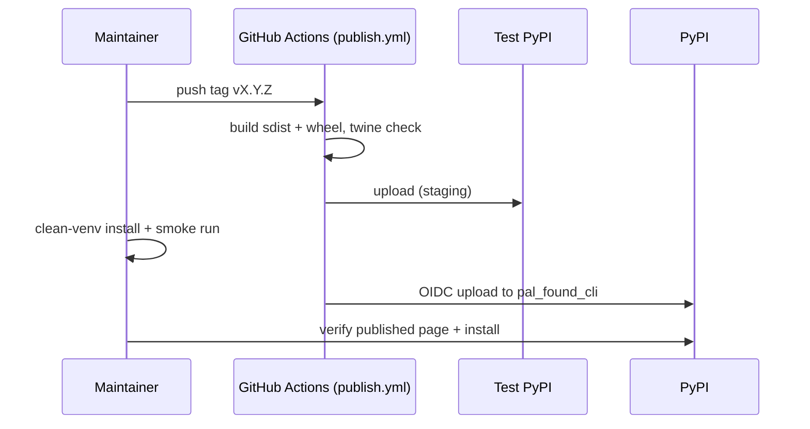

# Technical Design — SA-DES-004

## Publish the CLI Tool to PyPI for pip Installation

| Field | Value |
| --- | --- |
| **Document ID** | SA-DES-004 |
| **Feature** | FEATURE-004 |
| **Status** | In Progress |
| **Date** | 2026-08-13 |
| **Author** | Solution Architect |
| **Based on** | BA-DES-005 (business design), SA-ANA-004, BA-ANA-003 (analysis, Closed, PO-approved) |
| **Requirement source** | Project Owner architecture-change request 2026-08-11 |

## 1. Scope

Publish the CLI tool to PyPI so any user can install it with pip. The package is
published under the confirmed name `pal_found_cli` (ND-010-02, QUESTION-073 Closed)
with console commands under the `pal-found-` prefix (ND-010-03, QUESTION-074
Closed; mapping rows 6-7). The design covers the release pipeline, publish
workflow hardening, package metadata, and release verification.

## 2. API and Interface Changes

| Surface | Before | After |
| --- | --- | --- |
| Distribution name in `pyproject.toml` | `foundry-cli` | `pal_found_cli` (row 6) |
| Import package | `foundry_cli` | `pal_found_cli` (row 5, coordinated with FEATURE-010) |
| Console entry points (18 `foundry-*`) | `foundry-*` | `pal-found-*` (row 7), e.g. `pal-found-datasets` |
| Entry-point targets | `foundry_cli.<ns>.scripts.foundry_<ns>_cli:console_main` (datasets uses `:main`) | `pal_found_cli.<ns>.scripts.pal_found_<ns>_cli:console_main`, `:main` inconsistency normalized to `:console_main` |
| publish.yml workflow | tag-triggered, twine, `PYPI_API_TOKEN` secret | tag-triggered, twine validation, OIDC trusted publishing |
| PyPI project page | absent | present, README-based long description |

The distribution name on PyPI is independent of the import package name and of
the entry-point names; users install `pal_found_cli` and run `pal-found-*` commands.

## 3. Architecture Approach per Use Case

- UC-1 Build and validate: setuptools PEP 517 build on tag push; twine validates
  metadata and artifact consistency before any upload.
- UC-2 Staged release: first upload goes to Test PyPI; a clean-venv install and
  entry-point smoke run gate promotion to PyPI.
- UC-3 Secure publish: OIDC trusted publishing replaces the long-lived
  `PYPI_API_TOKEN`; the workflow requests a short-lived token with `id-token: write`
  and the PyPI project trusts the GitHub environment.
- UC-4 Upgrade path: each new tag publishes the next version; `pip install --upgrade`
  delivers it. Version is the single git tag, shared with conda (SA-DES-005).
- UC-5 Package page: README renders as the long description; install command and
  usage summary are visible.

## 4. Non-functional Requirements for Developers

| NFR | Requirement |
| --- | --- |
| SEC-1 | No embedded credentials in artifacts; OIDC replaces token-based publishing |
| SEC-2 | Third-party GitHub actions pinned to full SHA digests |
| REP-1 | Reproducible build from the tagged commit; sdist and wheel carry the new name |
| REL-1 | Every release verified with a clean-venv install before it is announced stable |
| VER-1 | Version derives from the git tag; no manual version drift |
| AVAIL-1 | Package page and artifacts served by PyPI; no self-hosted registry |
| DOC-1 | README documents install, usage, and the `pal-found-` prefix |

## 5. Infrastructure Changes

- PyPI project `pal_found_cli` created; Test PyPI project for staging.
- publish.yml updated: OIDC trusted publishing (permissions `id-token: write`),
  `v*` tag trigger, twine check kept.
- `PYPI_API_TOKEN` secret removed after OIDC is verified.
- Package metadata in `pyproject.toml`: name, entry points, package-data, ruff
  paths, coverage source aligned to the confirmed names.
- No new runtime dependencies.

## 6. Migration Procedure

1. Confirm `pal_found_cli` is available on PyPI; if a squatter holds it, open a
   naming question to the Project Owner before continuing.
2. Rename the distribution and entry points in `pyproject.toml`; verify the built
   sdist and wheel carry the new name and commands.
3. Update publish.yml to OIDC trusted publishing; keep twine validation.
4. Publish the first release to Test PyPI; install into a clean venv and smoke-run
   the entry points.
5. Promote to PyPI; verify the package page renders the README and the artifacts
   install from PyPI.
6. Revoke and remove `PYPI_API_TOKEN` after OIDC is verified.
7. Update installation documentation across the programme to the confirmed name
   and command prefix.
8. Rollback: keep the previous published version available; if a release fails
   verification, do not announce it and fix forward from the versioned source.

## 7. Risks and Mitigations

| Risk | Mitigation |
| --- | --- |
| Broken release | Clean-venv verification before stable announcement (REL-1) |
| Token leak | OIDC trusted publishing; scoped permissions (SEC-1) |
| Name conflict | Reserve `pal_found_cli` early; fallback documented with PO |
| Version drift with conda | Single source of truth: the git tag (SA-DES-005) |
| Entry-point inconsistency | Normalize datasets `:main` to `:console_main` during rename |

## 8. Traceability

| Artifact | Reference |
| --- | --- |
| Feature | FEATURE-004 |
| Epic | EPIC-010 |
| BA design sub-task | BA-DES-005 (In Progress) |
| SA design sub-task | SA-DES-004 |
| Analysis | BA-ANA-003, SA-ANA-004 (Closed, PO-approved) |
| Business design | BA-DES-005-business-design.md |
| Rename mapping | SA-ANA-010 rows 5-7 (ND-010-02/03, QUESTION-073/074 Closed) |
| Related features | FEATURE-002 (public hosting), FEATURE-005 (conda), FEATURE-010 (rename) |
