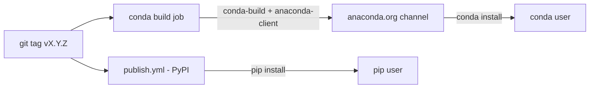

# Technical Design — SA-DES-005

## Publish the CLI Tool to a Conda Channel

| Field | Value |
| --- | --- |
| **Document ID** | SA-DES-005 |
| **Feature** | FEATURE-005 |
| **Status** | In Progress |
| **Date** | 2026-08-13 |
| **Author** | Solution Architect |
| **Based on** | BA-DES-006 (business design), SA-ANA-005, BA-ANA-005 (analysis, Closed, PO-approved) |
| **Requirement source** | Project Owner architecture-change request 2026-08-11 |

## 1. Scope

Publish the CLI tool to a conda channel so conda users can install it in one
command, complementing the PyPI channel (FEATURE-004). The package is published
under the confirmed name `pal_found_cli` (ND-010-02) with the `pal-found-` command
prefix (ND-010-03). The design covers channel selection, the conda recipe,
build and upload automation, and version alignment with PyPI.

## 2. API and Interface Changes

| Surface | Before | After |
| --- | --- | --- |
| Conda channel | absent | public channel on anaconda.org (Option A) |
| Conda recipe `meta.yaml` | absent | generated by grayskull, versioned in the tool repo |
| GitHub Actions CI | builds wheel only | adds a conda build + upload job on tags |
| Git tags | source of truth for releases | shared by PyPI and conda publication |
| README | pip install instructions | adds conda install instructions |
| Entry points in the recipe | n/a | `pal-found-*` entry points from `pyproject.toml` |

The package is pure Python; runtime dependencies (`foundry-platform-sdk`,
`python-dotenv`, `requests`) are already available on conda channels.

## 3. Architecture Approach per Use Case

- UC-1 Channel selection: Option A is an own public channel on anaconda.org with
  full control and no external review process. Option B (conda-forge feedstock) is
  a follow-up if a community channel is wanted. Recommended start: Option A.
- UC-2 Recipe generation: grayskull derives `meta.yaml` from `pyproject.toml`;
  the recipe is reviewed so the version comes from the git tag and runtime
  dependencies match the PyPI metadata.
- UC-3 Build and verify: `conda-build` produces the package; a clean conda
  environment install and entry-point smoke run gate the upload.
- UC-4 Automated upload: a CI job builds and uploads on tag pushes using scoped
  channel credentials; the channel page documents install instructions.
- UC-5 Version alignment: PyPI and conda releases are built from the same git tag,
  so versions cannot drift.

## 4. Non-functional Requirements for Developers

| NFR | Requirement |
| --- | --- |
| VER-1 | Conda and PyPI releases derive from the same git tag |
| REL-1 | Every conda release verified with a clean-env install before announcement |
| SEC-1 | Channel credentials scoped to maintainers; never embedded in artifacts |
| DEP-1 | All runtime dependencies verified present on the target channel |
| DOC-1 | Channel page and README document install and update commands |
| ACC-1 | Users without channel access receive a clear failure message |

## 5. Infrastructure Changes

- Create the anaconda.org channel (Option A) and confirm publishing rights.
- Add `meta.yaml` to the tool repo; document its version source.
- Extend CI with a conda build and upload job triggered by tags.
- Store channel credentials as a GitHub secret scoped to the tool repo.
- No changes to the Python runtime or packaging internals.

## 6. Migration Procedure

1. Select the channel (anaconda.org) and confirm publishing rights and access model.
2. Generate the recipe with grayskull from `pyproject.toml`; review `meta.yaml`
   for version source (git tag) and dependencies.
3. Build locally with `conda-build`; install into a clean conda environment and
   smoke-run the `pal-found-*` entry points.
4. Upload the first release to the channel; complete the channel page content.
5. Add the CI job that builds and uploads on tag pushes.
6. Check version alignment with the PyPI release (same tag) and record the result.
7. Update programme documentation to document both channels with the confirmed
   name.
8. Rollback: if a release fails verification, do not announce it; keep the previous
   channel version available and fix forward from the versioned source.

## 7. Risks and Mitigations

| Risk | Mitigation |
| --- | --- |
| Version drift | Both channels built from the same git tag (VER-1) |
| Broken release | Clean-env install check before announcing (REL-1) |
| Dependency missing on channel | Verify all runtime deps on the target channel (DEP-1) |
| Channel choice | Own channel first; feedstock later if community channel wanted |
| Credential leak | Scoped channel credentials, secret scanning |

## 8. Traceability

| Artifact | Reference |
| --- | --- |
| Feature | FEATURE-005 |
| Epic | EPIC-010 |
| BA design sub-task | BA-DES-006 (In Progress) |
| SA design sub-task | SA-DES-005 |
| Analysis | BA-ANA-005, SA-ANA-005 (Closed, PO-approved) |
| Business design | BA-DES-006-business-design.md |
| Rename mapping | SA-ANA-010 rows 6-7 (ND-010-02/03, QUESTION-073/074 Closed) |
| Related features | FEATURE-004 (PyPI), FEATURE-002 (public hosting), FEATURE-010 (rename) |
