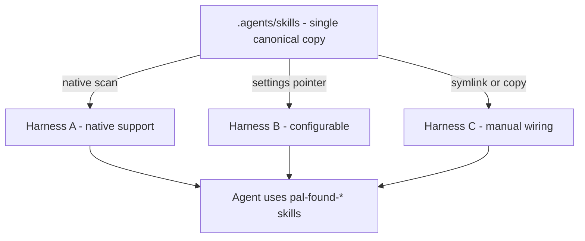

# Technical Design — SA-DES-006

## Store Skills in a Standard `.agents/skills` Folder for All Harnesses

| Field | Value |
| --- | --- |
| **Document ID** | SA-DES-006 |
| **Feature** | FEATURE-006 |
| **Status** | In Progress |
| **Date** | 2026-08-13 |
| **Author** | Solution Architect |
| **Based on** | BA-DES-007 (business design), SA-ANA-006, BA-ANA-006 (analysis, Closed, PO-approved) |
| **Requirement source** | Project Owner architecture-change request 2026-08-11 |

## 1. Scope

Move all agent skills to the standard `.agents/skills` folder so every supported
harness discovers and loads the same content, and rename skill folders with the
confirmed `pal-found-` prefix (ND-010-04, QUESTION-075 Closed; mapping rows 8-9).
One canonical location removes duplicated per-harness copies and keeps maintenance
consistent. This layout is the distribution unit consumed by FEATURE-007.

## 2. API and Interface Changes

| Surface | Before | After |
| --- | --- | --- |
| Skill folders (19: `foundry` + 18 namespaces) | under `.claude/skills` | under `.agents/skills`, named `pal-found` + `pal-found-*` |
| Skill frontmatter `name:` | `foundry-*` | `pal-found-*` |
| Skill cross-references | main skill names `foundry-*` skills | main skill names `pal-found-*` skills |
| Skill launcher scripts | `scripts/foundry_<ns>_cli.py` | `scripts/pal_found_<ns>_cli.py` (row 10) |
| AGENTS.md and documentation | reference `.claude/skills` | reference `.agents/skills` |
| Harness discovery | Claude Code reads `.claude/skills` | all harnesses read or point at `.agents/skills` |

No application interfaces change; the change is a file-layout and naming migration.

## 3. Architecture Approach per Use Case

- UC-1 Single canonical copy: `.agents/skills` holds every skill exactly once.
  No duplicate copies per harness.
- UC-2 Native discovery: harnesses that support `.agents/skills` natively need no
  configuration.
- UC-3 Non-native wiring: harnesses that do not recognize the folder receive
  documented onboarding instructions (settings entry, symlink, or copy).
- UC-4 Skill authoring: an author adds or updates a skill once in `.agents/skills`;
  all harnesses use that content.
- UC-5 Legacy cleanup: after discovery is verified on every harness, the old
  `.claude/skills` content is removed (or reduced to a pointer) so no skill content
  lives only in the old location.

## 4. Non-functional Requirements for Developers

| NFR | Requirement |
| --- | --- |
| DIS-1 | Every supported harness discovers all `pal-found-*` skills from the standard folder |
| INT-1 | Skill content stored once; no duplicate copies |
| CON-1 | Skill folder names and frontmatter use the confirmed `pal-found-` prefix |
| REF-1 | No documentation reference points at the retired `.claude/skills` layout |
| REC-1 | Rollback possible until all discovery checks pass; old location kept read-only |
| DOC-1 | Onboarding instructions exist for harnesses without native support |

## 5. Infrastructure Changes

- `.agents/skills` becomes the canonical skill location in the skills repository.
- Per-harness configuration files or pointers documented where native support is
  absent.
- AGENTS.md and documentation references updated to the new location.
- Old `.claude/skills` location kept read-only during migration, then removed.
- No new services, no runtime dependencies, no code changes to the tool.

## 6. Migration Procedure

1. Build the skill inventory and the per-harness capability record.
2. Rename each skill folder with the `pal-found-` prefix and move it into
   `.agents/skills`; update frontmatter, launcher script names, and internal
   cross-references between skills.
3. Run the discovery check per harness and record results.
4. Write onboarding instructions for harnesses that do not support the standard
   folder.
5. After all checks pass, remove the old `.claude/skills` location (or replace it
   with a pointer), verifying no skill content lives only there.
6. Update programme documentation (distribution guides, README) to cite the
   standard folder.
7. Rollback: keep the old location read-only until all discovery checks pass so
   skills can be restored if a harness fails discovery.

## 7. Risks and Mitigations

| Risk | Mitigation |
| --- | --- |
| Silent ignore | Per-harness discovery verification (DIS-1) |
| Content drift | Remove old location only after verification (UC-5) |
| Broken references | Documentation sweep in step 6 (REF-1) |
| Harness gap | Onboarding instructions per non-native harness (DOC-1) |
| Stale skill names | Rename sweep enforced by the `pal-found-` prefix gate (CON-1) |

## 8. Traceability

| Artifact | Reference |
| --- | --- |
| Feature | FEATURE-006 |
| Epic | EPIC-009 |
| BA design sub-task | BA-DES-007 (In Progress) |
| SA design sub-task | SA-DES-006 |
| Analysis | BA-ANA-006, SA-ANA-006 (Closed, PO-approved) |
| Business design | BA-DES-007-business-design.md |
| Rename mapping | SA-ANA-010 rows 8-10 (ND-010-04, QUESTION-075 Closed) |
| Related features | FEATURE-007 (distribution), FEATURE-010 (rename) |
