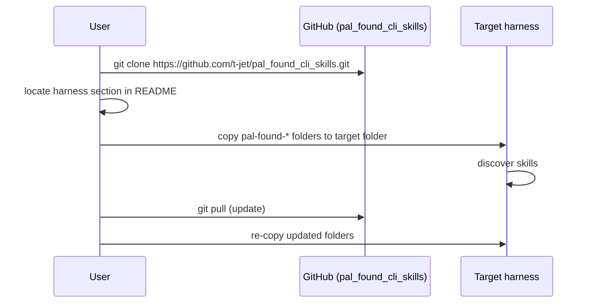

# Technical Design — SA-DES-007

## Distribute the Skills via Git Clone and Skill Copy

| Field | Value |
| --- | --- |
| **Document ID** | SA-DES-007 |
| **Feature** | FEATURE-007 |
| **Status** | In Progress |
| **Date** | 2026-08-13 |
| **Author** | Solution Architect |
| **Based on** | BA-DES-008 (business design), SA-ANA-007, BA-ANA-007 (analysis, Closed, PO-approved) |
| **Requirement source** | Project Owner architecture-change request 2026-08-11 |

## 1. Scope

Distribute the agent skills by git clone and skill copy: users clone the
`pal_found_cli_skills` repository (ND-010-01, QUESTION-072 Closed) and copy the
`pal-found-*` skill folders into their target harness. Distribution is file-based
and dependency-free. The design covers the distribution instructions, the
per-harness target map, and the update path.

## 2. API and Interface Changes

| Surface | Before | After |
| --- | --- | --- |
| Skills repository | nested repo, LICENSE only | populated with skills and README |
| Skill content | in the design repo under `.claude/skills` | in the skills repo under `.agents/skills` |
| README | absent | clone, copy, update instructions per harness |
| Release mechanism | none | repository tags express versions; repo state is the release |
| Supported harnesses | not distributed | per-harness copy target map |

No application interfaces change. Distribution is repository-based, not
package-based: there is no artifact publication step for skills.

## 3. Architecture Approach per Use Case

- UC-1 Clone: the repository is the single distribution unit; a fresh clone
  yields all skill content in the `.agents/skills` layout (FEATURE-006).
- UC-2 Copy: the README keeps one section per supported harness with the exact
  target folder (standard `.agents/skills`, or a documented harness-specific path).
- UC-3 Discovery verification: each harness section includes a verification step
  so a user can detect a wrong copy target.
- UC-4 Update: users pull or re-clone and re-copy; repository tags let users check
  out a specific release.
- UC-5 No dependencies: the flow needs only git and file copy; no package manager,
  no build step.

## 4. Non-functional Requirements for Developers

| NFR | Requirement |
| --- | --- |
| US-1 | Clone, copy, and update instructions complete and unambiguous for every supported harness |
| REP-1 | A fresh clone reproduces the exact skills repository state |
| DOC-1 | README at the repository root documents the full flow |
| VER-1 | Updates delivered by pull or re-clone; tags express versions |
| RES-1 | Distribution reversible by re-cloning the last good repository state |
| INT-1 | Copy target matches the `.agents/skills` layout where the harness supports it |

## 5. Infrastructure Changes

- Populate `pal_found_cli_skills`: move the 19 skill folders into `.agents/skills`,
  add LICENSE and README.
- Publish the repository publicly (coordinated with FEATURE-002).
- Version skills content with repository tags.
- No new services, no package managers, no runtime dependencies.

## 6. Migration Procedure

1. Confirm the skills repository layout matches the standard `.agents/skills`
   folder (FEATURE-006) so the copy step is uniform.
2. Author the README with three sections: cloning, copying per harness, and
   updating.
3. Record each supported harness and its target folder in the instructions.
4. Publish the instructions with the first public release of the skills repository
   (FEATURE-002).
5. Verify the instructions end to end on each supported harness: fresh clone,
   copy, discovery, update.
6. Announce the distribution method and keep the instructions versioned with the
   repository.
7. Rollback: distribution is file-based; an erroneous update is reverted by
   re-cloning the last good repository state and re-copying.

## 7. Risks and Mitigations

| Risk | Mitigation |
| --- | --- |
| Wrong copy target | Per-harness instructions with exact target paths (US-1) |
| Local drift | Update-by-re-clone guidance (VER-1) |
| Missing instructions | README at the repository root (DOC-1) |
| Layout mismatch | Copy target matches `.agents/skills` (FEATURE-006) |
| Stale copies | Tags and pull-based updates keep users current (RES-1) |

## 8. Traceability

| Artifact | Reference |
| --- | --- |
| Feature | FEATURE-007 |
| Epic | EPIC-009 |
| BA design sub-task | BA-DES-008 (In Progress) |
| SA design sub-task | SA-DES-007 |
| Analysis | BA-ANA-007, SA-ANA-007 (Closed, PO-approved) |
| Business design | BA-DES-008-business-design.md |
| Rename mapping | SA-ANA-010 rows 1, 8-10 (ND-010-01/04, QUESTION-072/075 Closed) |
| Related features | FEATURE-006 (layout), FEATURE-002 (public hosting), FEATURE-010 (rename) |
