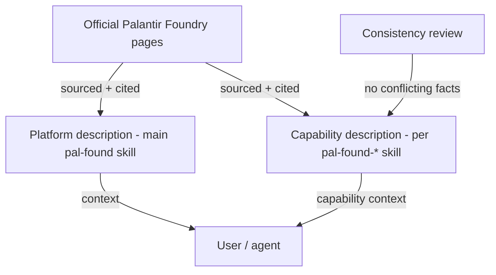

# Technical Design — SA-DES-008

## Add Palantir Foundry Platform and Capability Descriptions to Skills

| Field | Value |
| --- | --- |
| **Document ID** | SA-DES-008 |
| **Feature** | FEATURE-008 |
| **Status** | In Progress |
| **Date** | 2026-08-13 |
| **Author** | Solution Architect |
| **Based on** | BA-DES-009 (business design), SA-ANA-008, BA-ANA-008 (analysis, Closed, PO-approved) |
| **Requirement source** | Project Owner architecture-change request 2026-08-11 |

## 1. Scope

Add a brief Palantir Foundry platform description to the main `pal-found` skill
and a brief capability description to each specific `pal-found-*` CLI skill
(ND-010-04 naming, QUESTION-075 Closed). All description text is sourced from
official Palantir Foundry web pages with a source reference so facts stay
consistent and re-checkable. This is a content-only change to static markdown
skill files; no executable code or packaging changes.

## 2. API and Interface Changes

| Surface | Before | After |
| --- | --- | --- |
| Main `pal-found` skill | no platform description | brief platform description with source reference |
| 18 namespace skills | no capability description | short capability description per skill with source reference |
| Official Palantir Foundry web pages | external source | cited as description sources |
| Skill documentation | content only | content plus source citation and review date |
| Distribution channels | n/a | descriptions ship with the skills (FEATURE-006, FEATURE-007) |

No application interfaces change.

## 3. Architecture Approach per Use Case

- UC-1 Platform layer: the main skill states what Palantir Foundry is in plain
  language, so a user understands the platform context before any namespace skill.
- UC-2 Capability layer: each namespace skill describes the Foundry capability its
  tool covers (datasets, ontology, admin, and so on), tied to the skill's
  operation set.
- UC-3 Sourcing: text is drafted from official Palantir Foundry web pages and each
  description cites its source page and review date.
- UC-4 Consistency: a review pass checks that no two skills describe the same
  capability with conflicting facts and that descriptions stay brief and
  non-expert readable.
- UC-5 Maintenance: when official pages change, the cited sources identify which
  descriptions to re-check.

## 4. Non-functional Requirements for Developers

| NFR | Requirement |
| --- | --- |
| ACC-1 | Description text traces to an official Palantir Foundry web page (source cited) |
| CON-1 | No two skills describe the same capability with conflicting facts |
| BRE-1 | Descriptions brief and understandable by a non-expert user |
| LIC-1 | Text paraphrased briefly with attribution; no over-quoting |
| MAT-1 | Capability description matches the skill's actual operation set |
| MAI-1 | Review date recorded; re-check triggered when source pages change |

## 5. Infrastructure Changes

- Content sections added to 19 skill files (main + 18 namespaces) under
  `.agents/skills`.
- No services, no code, no dependencies, no build step.

## 6. Migration Procedure

1. Compile the list of official source pages: one platform page and one page per
   covered capability.
2. Draft the platform description and the capability descriptions with source
   references; keep each to a short paragraph.
3. Add the standard content section to the main skill and to each specific skill.
4. Run the consistency review (ACC-1, CON-1, BRE-1) and fix any conflicting or
   stale text.
5. Ship the updated skills through the standard distribution paths (FEATURE-006,
   FEATURE-007).
6. Record the review date and source references so re-checks happen when official
   pages change.
7. Rollback: descriptions are additive content; reverting means restoring the
   prior skill files from the repository history.

## 7. Risks and Mitigations

| Risk | Mitigation |
| --- | --- |
| Source drift | Cite source page; re-check on page changes (MAI-1) |
| Fact drift | Match description to the skill's operation set at review (MAT-1) |
| Licensing | Paraphrase briefly with attribution (LIC-1) |
| Inconsistency | Consistency review across all descriptions (CON-1) |
| Stale names | Descriptions authored against the confirmed `pal-found-*` names |

## 8. Traceability

| Artifact | Reference |
| --- | --- |
| Feature | FEATURE-008 |
| Epic | EPIC-009 |
| BA design sub-task | BA-DES-009 (In Progress) |
| SA design sub-task | SA-DES-008 |
| Analysis | BA-ANA-008, SA-ANA-008 (Closed, PO-approved) |
| Business design | BA-DES-009-business-design.md |
| Rename mapping | SA-ANA-010 rows 8-10 (ND-010-04, QUESTION-075 Closed) |
| Related features | FEATURE-006 (layout), FEATURE-007 (distribution), FEATURE-010 (rename) |
