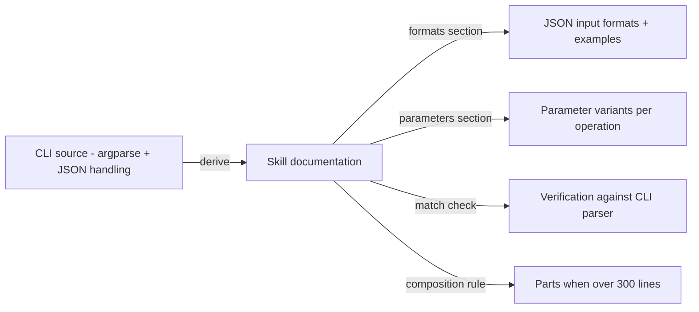

# Technical Design — SA-DES-009

## Document All JSON Formats and Parameter Variants in Each Skill File

| Field | Value |
| --- | --- |
| **Document ID** | SA-DES-009 |
| **Feature** | FEATURE-009 |
| **Status** | In Progress |
| **Date** | 2026-08-13 |
| **Author** | Solution Architect |
| **Based on** | BA-DES-010 (business design), SA-ANA-009, BA-ANA-009 (analysis, Closed, PO-approved) |
| **Requirement source** | Project Owner architecture-change request 2026-08-11 |

## 1. Scope

Make every specific `pal-found-*` CLI skill self-contained for usage: each skill
file documents every JSON format the tool accepts and every allowed parameter
variant for each operation (ND-010-04 naming, QUESTION-075 Closed). A user with
only the skill file can use the tool correctly without consulting any other
source. Skill files stay within the 300-line composition limit; large skills
split into parts.

## 2. API and Interface Changes

| Surface | Before | After |
| --- | --- | --- |
| 18 namespace skill files | partial usage guidance | every JSON input format and parameter variant documented |
| CLI implementation | source of truth for formats | unchanged; documentation matches it |
| Skill file size | within limits | may grow; composition rule applied when needed |
| Users and agents | may need external sources | self-contained skill usage |
| Cross-references | n/a | large skills reference parts under a subdirectory |

No application interfaces change. The authoritative source for formats and
variants is the CLI itself: argparse definitions for parameter variants and JSON
body handling for input formats.

## 3. Architecture Approach per Use Case

- UC-1 Formats section: one entry per JSON-bearing option with the accepted schema
  and an example.
- UC-2 Parameters section: one entry per operation listing required and optional
  parameters, allowed values, and variants such as flags, short forms, and
  positional alternatives.
- UC-3 Self-containment: a user with only the skill file can construct a correct
  command; no external look-up required.
- UC-4 Match check: documented formats and variants are verified against the CLI
  parser at review time so the documentation cannot drift from the tool.
- UC-5 Composition: a skill file that grows past 300 lines splits into parts under
  a subdirectory, with the main skill file referencing the parts.

## 4. Non-functional Requirements for Developers

| NFR | Requirement |
| --- | --- |
| ACC-1 | Every JSON format accepted by the tool is documented per skill |
| ACC-2 | Every allowed parameter variant is documented per operation |
| SEL-1 | A user with only the skill file can run the tool correctly |
| MAT-1 | Documented formats and variants match the tool at review time |
| COMP-1 | No skill file exceeds the 300-line composition limit; parts split as needed |
| MAI-1 | Skill documentation updated in the same change cycle as the tool |

## 5. Infrastructure Changes

- Standard documentation sections added to 18 namespace skill files under
  `.agents/skills`.
- Optional part files under a per-skill subdirectory for oversized skills.
- No services, no code changes, no dependencies, no build step.

## 6. Migration Procedure

1. Prioritize the skill files by operation count; start with the largest skills
   where drift risk is highest.
2. For each skill, enumerate operations from the CLI source and build the operation
   records, verifying each format and variant against the tool.
3. Write the standard documentation section into the skill file; if the file
   exceeds the composition limit, split it into parts with the main file carrying
   the references.
4. Run the match check per skill and fix discrepancies.
5. Update the distribution documentation and any cross-references.
6. Make skill documentation part of tool change cycles so formats stay in step.
7. Rollback: documentation changes are reverted from the repository history if a
   match check fails after a change.

## 7. Risks and Mitigations

| Risk | Mitigation |
| --- | --- |
| Doc drift | Tool-conformance review (MAT-1); update on tool changes |
| Wrong usage | Self-contained accuracy enforced at review (SEL-1) |
| File size | Split into parts with references from the main file (COMP-1) |
| Enumeration gaps | Audit derived from parser source, not from memory |
| Stale names | Documentation authored against the confirmed `pal-found-*` names |

## 8. Traceability

| Artifact | Reference |
| --- | --- |
| Feature | FEATURE-009 |
| Epic | EPIC-009 |
| BA design sub-task | BA-DES-010 (In Progress) |
| SA design sub-task | SA-DES-009 |
| Analysis | BA-ANA-009, SA-ANA-009 (Closed, PO-approved) |
| Business design | BA-DES-010-business-design.md |
| Rename mapping | SA-ANA-010 rows 8-10 (ND-010-04, QUESTION-075 Closed) |
| Related features | FEATURE-006 (layout), FEATURE-008 (descriptions), FEATURE-010 (rename) |
