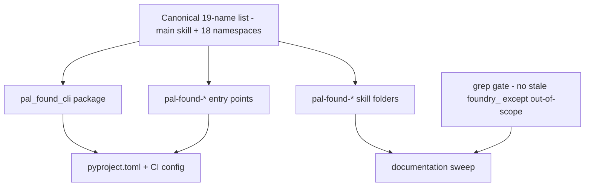

# Technical Design — SA-DES-010

## Rename the `foundry_` Prefix to `pal_found_` Across All Three Projects

| Field | Value |
| --- | --- |
| **Document ID** | SA-DES-010 |
| **Feature** | FEATURE-010 |
| **Status** | In Progress |
| **Date** | 2026-08-13 |
| **Author** | Solution Architect |
| **Based on** | BA-DES-011 (business design), SA-ANA-010, BA-ANA-010 (analysis, Closed, PO-approved) |
| **Requirement source** | Project Owner change request 2026-08-12 |

## 1. Scope

Rename the `foundry_` prefix to `pal_found_` across all public surfaces of the
three projects. Target names are CONFIRMED by the Project Owner on 2026-08-12
(ND-010-01..04, QUESTION-072..075 Closed). This design is the cross-cutting
reference: the mapping table below is the source of truth every other SA-DES
(002..009) cites for names. Only names change; behaviour, operations, and data
are unchanged.

## 2. Confirmed Rename Mapping (reference for all designs)

| # | Old | New (CONFIRMED) | Notes |
| --- | --- | --- | --- |
| 1 | repo `foundry_cli` | `pal_found_cli` | design/docs/tracking repo |
| 2 | repo `foundry_cli_tool` | `pal_found_cli_tool` | CLI source repo |
| 3 | repo `foundry_cli_skills` | `pal_found_cli_skills` | skills repo |
| 4 | submodule URLs `t-jet/foundry_cli_tool.git`, `t-jet/foundry_cli_skills.git` | `t-jet/pal_found_cli_tool.git`, `t-jet/pal_found_cli_skills.git` | update `.git/config` + `.gitmodules`; GitHub redirects keep old URLs resolving |
| 5 | package `foundry_cli` | `pal_found_cli` | `src/` tree, all imports |
| 6 | distribution `foundry-cli` | `pal_found_cli` | PyPI project name |
| 7 | entry points `foundry-*` (18) | `pal-found-*` (18) | e.g. `foundry-datasets` to `pal-found-datasets` |
| 8 | main skill `foundry` | `pal-found` | folder, `name:` frontmatter |
| 9 | skills `foundry-*` (18) | `pal-found-*` (18) | folders, frontmatter, cross-references |
| 10 | skill scripts `foundry_<ns>_cli.py` | `pal_found_<ns>_cli.py` | modules keep underscores; folders use `pal-found-*` |
| 11 | env vars `FOUNDRY_AGENTIC_CLI_*` | `PAL_FOUND_AGENTIC_CLI_*` | OPEN, PO decision; 789 occurrences in ENV-REF-001, 19 in `.env.example` |
| 12 | test files `test_foundry_*_cli.py` | `test_pal_found_*_cli.py` | follows package rename mechanically |
| 13 | docs `SRS-001-foundry-cli.md`, `SAD-001-foundry-cli.md` | `SRS-001-pal-found-cli.md`, `SAD-001-pal-found-cli.md` | PROPOSED; PO decides whether historical docs rename |
| 14 | coverage `source = ["foundry_cli"]` | `source = ["pal_found_cli"]` | `pyproject.toml`, `ci.yml --cov` |
| 15 | package-data, ruff ignores paths | prefix swap `foundry_cli` to `pal_found_cli` | `pyproject.toml` |

Rows 1-10 CONFIRMED. Rows 11 and 13 remain OPEN PO decisions; row 12 follows
mechanically. Out of scope and unchanged: `foundry_sdk`, `foundry-platform-sdk`,
`FOUNDRY_TOKEN`, `FOUNDRY_HOSTNAME`, `foundry_sdk.v2` imports, Palantir SDK env
vars.

## 3. API and Interface Changes

| Surface | Before | After |
| --- | --- | --- |
| Import namespace | `foundry_cli` (18 subpackages + common) | `pal_found_cli` |
| Distribution name | `foundry-cli` | `pal_found_cli` |
| Console entry points (18) | `foundry-*` | `pal-found-*` |
| Skill folders (19) | `foundry`, `foundry-*` | `pal-found`, `pal-found-*` |
| Skill launcher scripts | `foundry_<ns>_cli.py` | `pal_found_<ns>_cli.py` |
| Env var prefix | `FOUNDRY_AGENTIC_CLI_*` | `PAL_FOUND_AGENTIC_CLI_*` (if row 11 confirmed) |
| Test file names | `test_foundry_*_cli.py` | `test_pal_found_*_cli.py` |
| CI/CD config | `--cov=foundry_cli`, package refs | `--cov=pal_found_cli`, updated refs |

No functional API change: auth, access control, output formats, exit codes,
retry, and tracing are untouched.

## 4. Architecture Approach per Use Case

- UC-1 Identity rename: one rule applies: every project-owned identifier carrying
  the `foundry_` prefix moves to `pal_found_`; every Palantir-owned identifier
  stays. Zero functional change.
- UC-2 Single source of names: repo names, package, distribution, entry points,
  and skills derive from one canonical list of 19 names; the rename is one
  coordinated sweep, not per-file edits.
- UC-3 Atomic config change: `pyproject.toml`, `ci.yml`, and `publish.yml`
  reference the package and entry-point names and change atomically with the code.
- UC-4 Skills sweep: skill cross-references are content-coupled; the main skill
  names every namespace skill and each skill names its launcher and env vars.
- UC-5 Verification gate: full suite (pytest, mypy, ruff, bandit), coverage
  >= 80%, and an 18-entry-point smoke pass gate each phase.

## 5. Non-functional Requirements for Developers

| NFR | Requirement |
| --- | --- |
| BEH-1 | No runtime behaviour change; only names change |
| CON-1 | All names derive from the confirmed mapping; no partial renames |
| VER-1 | Full suite green with coverage >= 80% after each phase |
| SMK-1 | All 18 renamed entry points smoke-run successfully |
| GREP-1 | No stale project-owned `foundry_` reference remains outside historical notes and out-of-scope SDK names |
| MIG-1 | Migration notes tell existing users how clones, scripts, and skill references change |
| SEC-1 | Publishing tokens and credentials scoped to the renamed repositories |

## 6. Infrastructure Changes

- GitHub repo renames with redirects; submodule URL updates (rows 1-4).
- Package and pipeline rename in `pyproject.toml`, `ci.yml`, `publish.yml`
  (rows 5-7, 14-15).
- Skill folder and script renames in both layouts, `.claude/skills` and
  `.agents/skills` (rows 8-10).
- Env-var code paths and `.env.example` (row 11, pending PO).
- Docs sweep: `document_index.md`, SRS/SAD (row 13, pending PO), ENV-REF-001,
  metadata-allow-list, DEVOPS/TESTCASE/TESTEXEC references.
- Release: bump to 0.2.0; publish `pal_found_cli` to pip (FEATURE-004) and conda
  (FEATURE-005).

## 7. Migration Procedure

1. Phase 0 - Decisions: naming decisions confirmed (QUESTION-072..075 Closed
   2026-08-12). COMPLETE.
2. Phase 1 - Repos: rename the three GitHub repositories, fix submodule URLs,
   update local clones. History preserved through GitHub redirects.
3. Phase 2 - Package and pipeline: code move, imports, entry points, config, CI,
   tests. Gate: full suite green, coverage >= 80%, 18 entry-point smoke pass.
4. Phase 3 - Skills: rename 19 skill folders, frontmatter, and scripts in both
   layouts; update cross-references; re-verify against FEATURE-008/009 content.
5. Phase 4 - Docs: sweep `document_index.md`, SRS/SAD, ENV-REF-001,
   metadata-allow-list, DEVOPS/TESTCASE/TESTEXEC references.
6. Phase 5 - Release: bump version, publish pip + conda as `pal_found_cli`, update
   the publish pipeline, announce with a migration note for row 11.
7. Rollback: keep old-name redirects and a release tag for the last old-name state;
   verify behaviour before any rollback decision.

## 8. Risks and Mitigations

| Risk | Mitigation |
| --- | --- |
| Submodule URLs and clones break | GitHub redirects; update `.gitmodules` + local remotes; verify fresh clones |
| Imports, entry points, coverage drift apart | Single atomic change set; suite + entry-point smoke gate |
| Env-var rename breaks user configs | PO decision; compatibility note, deprecated alias period (row 11) |
| Skill cross-references go stale | Scripted sweep + content verification against FEATURE-008/009 |
| Missed references in historical docs | Full-tree grep gate (GREP-1) |
| Accidental rename of `foundry_sdk` | Out-of-scope list enforced in the grep gate |
| Downstream designs used current names | SA-DES-002..009 cite this mapping; naming updates coordinated |

## 9. Traceability

| Artifact | Reference |
| --- | --- |
| Feature | FEATURE-010 |
| Epics | EPIC-009, EPIC-010 |
| BA design sub-task | BA-DES-011 (In Progress) |
| SA design sub-task | SA-DES-010 |
| Analysis | BA-ANA-010, SA-ANA-010 (Closed, PO-approved) |
| Business design | BA-DES-011-business-design.md |
| Naming decisions | ND-010-01..04 (QUESTION-072..075 Closed 2026-08-12) |
| Related features | FEATURE-002..009 (all cite this mapping) |
