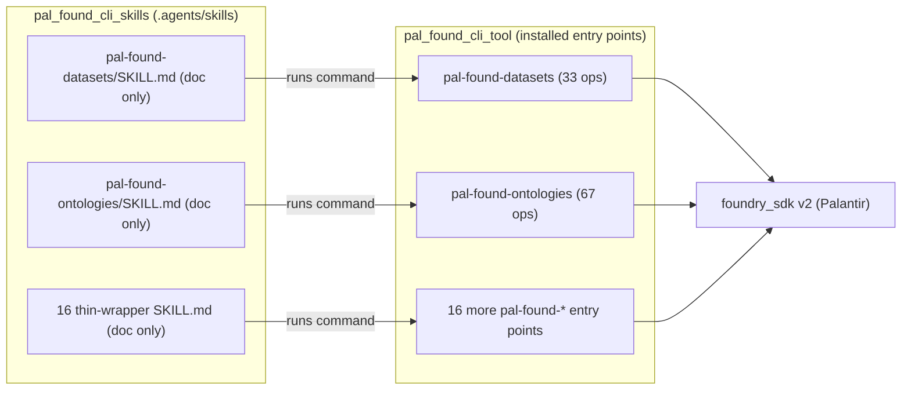

# Technical Design: SA-DES-011

## Skills Use the CLI Interface Only: Remove Python Scripts, Retire the Launcher Layer, Migrate Datasets/Ontologies Implementations to the Tool

| Field | Value |
| --- | --- |
| **Document ID** | SA-DES-011 |
| **Feature** | FEATURE-011 |
| **Status** | In Progress |
| **Date** | 2026-09-30 |
| **Author** | Solution Architect |
| **Based on** | BA-DES-012 (business design), SA-ANA-012, BA-ANA-012 (analysis, Resolved) |
| **Requirement source** | Project Owner change request 2026-09-30 (FEATURE-011) |

## 1. Scope

FEATURE-011 requires that the `pal_found_cli_skills` repository's skills use only
the CLI interface and contain no separate Python scripts. Any command
implementation needed by a skill must live in the tool (`pal_found_cli_tool`).
This technical design specifies how to:

- Sweep all 19 skill folders in `.agents/skills` to the doc-only model (single
  `SKILL.md` that invokes an installed `pal-found-*` command).
- Retire the `scripts/` launcher layer from the 16 thin-wrapper skills.
- Remove the stale standalone `scripts/` copies from the datasets and ontologies
  skills, whose canonical implementations already live in the tool.
- Keep the tool command surface unchanged (datasets 33 ops / ontologies 67 ops,
  verified supersets); no new tool command is required.
- Communicate the infrastructure, packaging, and onboarding implications.

The change is a content-model and packaging change. Runtime behaviour, operation
catalogs, auth, access control, output formats, exit codes, retry, and tracing
are unchanged. Palantir-owned identifiers (`foundry_sdk`, `foundry-platform-sdk`,
`FOUNDRY_TOKEN`, `FOUNDRY_HOSTNAME`) are untouched.

## 2. Repository-Level and Interface Changes

### 2.1 Skills repository (`pal_found_cli_skills`)

| Folders | Before | After |
| --- | --- | --- |
| `pal-found` (knowledge skill) | doc-only `SKILL.md` (no `scripts/`) | unchanged |
| 16 thin-wrapper namespace skills | `SKILL.md` + `scripts/pal_found_<ns>_cli.py` (10-26 line launcher) | `SKILL.md` only; `scripts/` removed |
| `pal-found-datasets` | `SKILL.md` + `scripts/pal_found_datasets_cli.py` (526-line standalone) | `SKILL.md` only; `scripts/` removed |
| `pal-found-ontologies` | `SKILL.md` + `scripts/pal_found_ontologies_cli.py` (503-line standalone) | `SKILL.md` only; `scripts/` removed |

After the change every namespace skill folder contains exactly one file,
`SKILL.md`, that documents the skill's operations and invokes the installed
`pal-found-<ns>` command by name. No folder retains a `scripts/` directory.

### 2.2 Interface changes at the command level

| Surface | Before | After |
| --- | --- | --- |
| Skill invocation | `python .../scripts/pal_found_<ns>_cli.py <resource> <op> ...` | `pal-found-<ns> <resource> <op> ...` |
| Skill runtime dependency | launcher locates `src/pal_found_cli/` via directory walk and manipulates `sys.path` | no Python knowledge; relies on installed `pal-found-*` entry points |
| Installation prerequisite | not stated in skill folders | every `SKILL.md` and onboarding states the `pal_found_cli` package dependency and a one-line install command per package manager (conda `-c t-jet`, pip, uv) |

There is no behavioural interface change for the tool. All 18 `pal-found-*`
entry points remain installed and callable with unchanged semantics.

### 2.3 Tool repository (`pal_found_cli_tool`)

The tool already owns the canonical command implementations. `pyproject.toml`
`[project.scripts]` exposes the 18 `pal-found-*` entry points (verified
2026-09-30). Datasets and ontologies are already present and are verified
supersets of the stale skill copies. The tool requires **no change** for
FEATURE-011. Entry points of interest:

| Entry point | Target | Operations |
| --- | --- | --- |
| `pal-found-datasets` | `pal_found_cli.datasets.scripts.pal_found_datasets_cli:main` | 33 across 5 resource clients |
| `pal-found-ontologies` | `pal_found_cli.ontologies.scripts.pal_found_ontologies_cli:console_main` | 67 |

## 3. Architecture Approach: the Doc-Only Skill Model

Each namespace skill is a single `SKILL.md` that documents the skill's purpose
and operations and invokes the installed `pal-found-<ns>` command by name. The
tool is the single source of command behaviour.

### 3.1 Component flow

### 3.2 Use cases

| UC | Approach |
| --- | --- |
| UC-1 Doc-only skill | A skill is one `SKILL.md`; no `scripts/`, no launcher, no `sys.path` manipulation. Agents run `pal-found-<ns> <resource> <op> ...` as installed commands. |
| UC-2 Launcher retirement | The 16 thin launchers proxy to the packaged module and add no behaviour. Removal changes nothing at the command level because the packaged entry points stay installed. The only requirement is that each `SKILL.md` usage text references `pal-found-<ns>` instead of a `python ..._cli.py` path. |
| UC-3 Datasets/ontologies migration | The tool owns canonical `pal-found-datasets` (33 ops) and `pal-found-ontologies` (67 ops) implementations that are verified supersets of the skill copies. The migration removes the stale `scripts/` copies and rewrites the two `SKILL.md` files to invoke the tool commands. No net-new tool command. |
| UC-4 Packaging and onboarding | Distribution of skills becomes documentation-only. Onboarding states the tool-install prerequisite with a one-line per-manager install command. The tool distribution surface (pip via EPIC-010 / conda) is unchanged. |

### 3.4 Install-requirement propagation into every `SKILL.md`

Because a doc-only skill ships no executable code, its whole command surface
comes from the installed tool. The Project Owner requirement (QUESTION-149)
mandates that every skill's `SKILL.md` state the dependency on the installed
`pal_found_cli` package and give a short, one-line install instruction per
package manager. The design adopts the exact wording from SA-ANA-012 §3.4:

| Package manager | Command | Notes |
| --- | --- | --- |
| conda | `conda install -c t-jet pal_found_cli` | anaconda.org `t-jet` channel (SA-ANA-005 / EPIC-010) |
| PyPI / pip | `pip install pal_found_cli` | PyPI distribution (SA-ANA-004 / EPIC-010) |
| uv | `uv tool install pal_found_cli` (or `uv pip install pal_found_cli` in an active env) | uv front-end over the same PyPI distribution |

Each of the 18 namespace `SKILL.md` files carries this table (or the equivalent
three commands) next to its `pal-found-*` usage examples, and the onboarding and
distribution guides state the same prerequisite. This keeps every skill
self-contained, verifiable, and free of any interpreter, launcher path, or
vendored copy, and satisfies the PO install-requirement for the doc-only model.

## 4. Datasets/Ontologies Migration and Operation Parity

The analysis (SA-ANA-012, cross-checked with BA-ANA-012) verified on 2026-09-30
that the tool implementations are supersets of the stale skill copies:

| Source | Datasets | Ontologies |
| --- | --- | --- |
| Tool (`pal_found_cli_tool/src/pal_found_cli/...`) | 33 ops across 5 resource clients | 67 ops |
| Skill copy (`.agents/skills/.../scripts/`) | 526 lines | 503 lines |

Because the tool catalog is larger and covers the skill copies, migration is a
removal of duplicate skill copies, not a net-new tool command. Parity is
preserved per behaviour requirement BR-011-06 because the tool copy is the
authoritative implementation.

### 4.1 Parity verification procedure

For each of datasets and ontologies:

1. Enumerate the operation catalog (resource / operation subcommands) from the
   installed `pal-found-<ns>` command surface.
2. Confirm the previously-documented skill operation set is a subset of that
   catalog.
3. Record the result in the migration verification step; the QA test execution
   then independently confirms behaviour parity (operation count 33/67).

## 5. Non-Functional Requirements for Developers

| NFR | Requirement |
| --- | --- |
| MNT-1 | Command logic exists in exactly one place (the tool); skills are doc-only and human-maintainable. |
| USE-1 | Using a skill requires no Python knowledge and no launcher path resolution. |
| COM-1 | All 18 `pal-found-*` commands remain installed and callable with unchanged behaviour. |
| CNS-1 | No `SKILL.md` command example references `python ..._cli.py` (AC-011-02 sweat sweep). |
| DIS-1 | Skills distribute as documentation only; copy instructions carry no executable code (AC-011-06, AC-011-01). |
| SEC-1 | No auth, credential, or access-control changes; ADR-007 applies unchanged to installed commands. |
| PRF-1 | No change to Foundry request volumes or transfer sizes (BA-ANA-012 10-11). |
| VER-1 | No `scripts/` directory remains in any namespace skill folder. |
| VER-2 | Every namespace `SKILL.md` invokes an installed `pal-found-<ns>` command, states the `pal_found_cli` package dependency, and gives a one-line install command per package manager: `conda install -c t-jet pal_found_cli`, `pip install pal_found_cli`, `uv tool install pal_found_cli` (or `uv pip install pal_found_cli` in an active env). |

## 6. Infrastructure and Packaging Changes

- Skills repo: delete the `scripts/` directory from all 18 namespace skill
  folders. No packaging change in the skills repo other than the removal of
  executable assets (skills distribute as documentation).
- Tool repo: no source or `pyproject.toml` change. The 18 `pal-found-*` entry
  points and package-data (metadata allow-lists) stay as-is.
- Onboarding: add the tool-install prerequisite statement with a one-line
  install command per package manager (`conda install -c t-jet pal_found_cli`,
  `pip install pal_found_cli`, `uv tool install pal_found_cli`), then note how
  skills are installed by git clone / skill copy (FEATURE-007) and the tool by
  pip (EPIC-010 / FEATURE-004) or conda (FEATURE-005).
- CI/gates: add a gate that fails if `python ..._cli.py` invocation text or a
  `scripts/` directory appears in the skills repo. Re-run the skills-repo test
  suite and markdown lint.
- Docs: update SA-DES/BUSINESS-DESIGN/DEVOPS/TESTCASE/TESTEXEC deliverables
  that reference the launcher pattern; register this change in
  `document_index.md`.

## 7. Step-by-Step Migration Procedure

1. Phase 1 - Docs sweep: rewrite all 18 namespace `SKILL.md` invocation text from
   `python ..._cli.py` to `pal-found-<ns>`; add the `pal_found_cli` dependency
   statement plus a one-line per-manager install example (`conda install -c
   t-jet pal_found_cli`, `pip install pal_found_cli`, `uv tool install
   pal_found_cli`); remove any `scripts/` references. Update onboarding and
   cross-referencing deliverables.
2. Phase 2 - Remove `scripts/`: delete the launcher and standalone-copy
   directories from the 18 namespace skill folders; verify no retained code
   references remain (VER-1).
3. Phase 3 - Verify datasets/ontologies parity: enumerate the tool catalog,
   confirm the skill operation set is a subset (33/67), no new tool command.
4. Phase 4 - Verify distribution: run the skills-repo test suite, markdown lint,
   and the CI gate that rejects `python ..._cli.py` text and `scripts/`
   directories (VER-1, VER-2).
5. Phase 5 - Register: update `document_index.md` and link this deliverable.

Rollback: the skills repository keeps clean git history, so reverting is a
restore of the deleted `scripts/` folders and `SKILL.md` text from the prior
release tag. No tool-side rollback is required because the tool is untouched.

## 8. Risks and Mitigations

| Risk | Mitigation |
| --- | --- |
| Tool install missing leaves commands unavailable | Clear prerequisite statement plus a one-line per-manager install command (`conda install -c t-jet pal_found_cli`, `pip install pal_found_cli`, `uv tool install pal_found_cli`) in every `SKILL.md` and onboarding (BA-ANA-012 9, SA-ANA-012 §3.4). |
| Stale `python ..._cli.py` invocation text persists | AC-011-02 sweep of all 18 `SKILL.md` files; CI/markdown gate. |
| Datasets/ontologies drift between tool and removed copy | Superset verified at analysis and parity reconfirmed in migration (4.1) and QA; tool is the single source. |
| Downstream docs still describe the launcher pattern | Reference sweep in the migration phase; `document_index.md` updated. |
| Design/story misalignment | SA-DES-011 maps to the DEV-STORYs the BA creates under FEATURE-011 (section 9); gaps escalated to the BA or via a QUESTION sub-task. |

## 9. Traceability and DEV-STORY Mapping

| Artifact | Reference |
| --- | --- |
| Feature | FEATURE-011 (In Design) |
| Epic | EPIC-011 (FeatureContains) |
| BA design sub-task | BA-DES-012 (business design, Open) |
| SA design sub-task | SA-DES-011 (this deliverable) |
| Analysis | SA-ANA-012, BA-ANA-012 (Resolved) |
| Related docs | `document_index.md`, SAD-001, ADRs 001-007, canonical-env-var-reference, metadata-allow-list |
| Tool surface | `pal_found_cli_tool/pyproject.toml` `[project.scripts]` (18 `pal-found-*` entry points) |
| Skills surface | `pal_found_cli_skills/.agents/skills/pal-found-*` (19 folders) |

### 9.1 DEV-STORY mapping

The BA created three implementation units under FEATURE-011 during BA-DES-012.
The SA-DES design maps to them as follows:

| SA-DES section | DEV-STORY | Scope |
| --- | --- | --- |
| 3.2 UC-2, 2.1 (16 wrappers), 7 Phase 1-2 | DEV-STORY-038 | Convert the 16 thin-wrapper skills to documentation-only: remove each launcher `scripts/pal_found_<ns>_cli.py`, rebase each `SKILL.md` to invoke the installed `pal-found-<ns>` command (AC-D-012-01..03). |
| 2.1 (datasets/ontologies), 3.2 UC-3, 4 parity | DEV-STORY-039 | Migrate datasets and ontologies command implementations to the tool and remove stale skill copies: remove `scripts/pal_found_datasets_cli.py` and `scripts/pal_found_ontologies_cli.py`, confirm `pal-found-datasets` (33 ops) and `pal-found-ontologies` (67 ops) preserve all operations with unchanged behavior (AC-D-012-04, AC-D-012-05, AC-D-012-07). |
| 6, 5 VER-1/VER-2, 7 Phase 4-5, 3.4 | DEV-STORY-040 | Update distribution and onboarding for documentation-only skills: state the `pal_found_cli` dependency and the one-line per-manager install commands (conda `-c t-jet`, pip, uv) in every `SKILL.md` and the onboarding guide, sweep all 18 `SKILL.md` files for stale `python ..._cli.py` references, run the doc-only acceptance criteria and behavior checks (AC-D-012-02, AC-D-012-08). |

The three DEV-STORYs cover the design's implementation units completely. No
technical-design gap requiring a new or expanded story was found; the BA's
DEV-STORY decomposition matches this design 1:1. Should a gap surface during
implementation, the SA will note it for the BA or raise a QUESTION sub-task with
a Blocks link.
