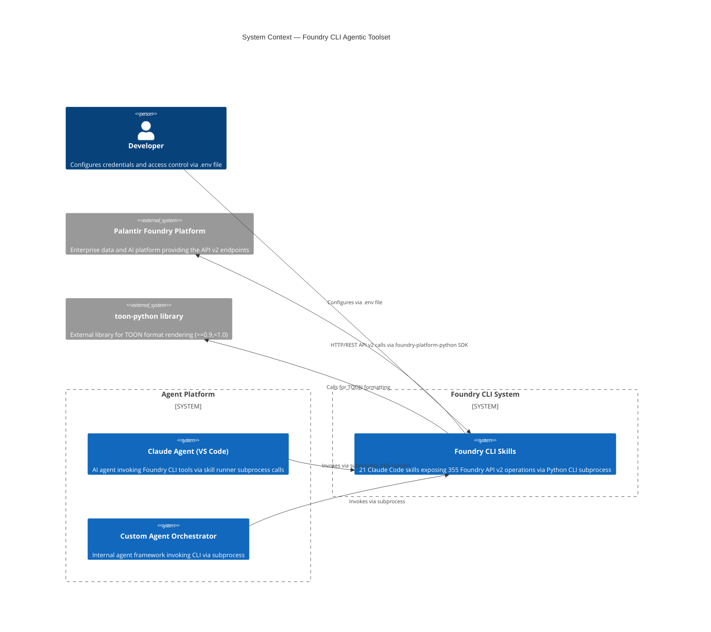
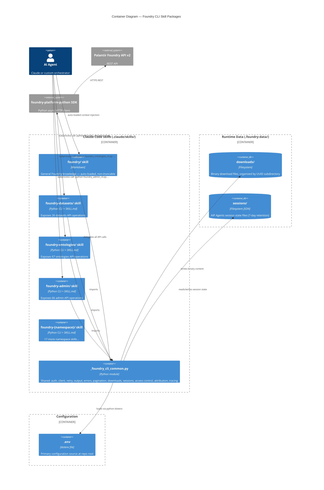
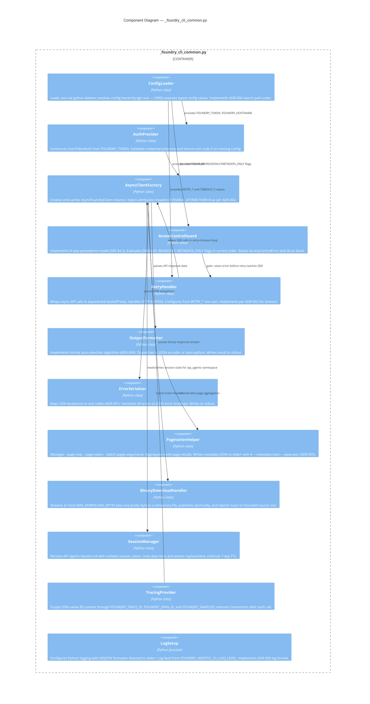
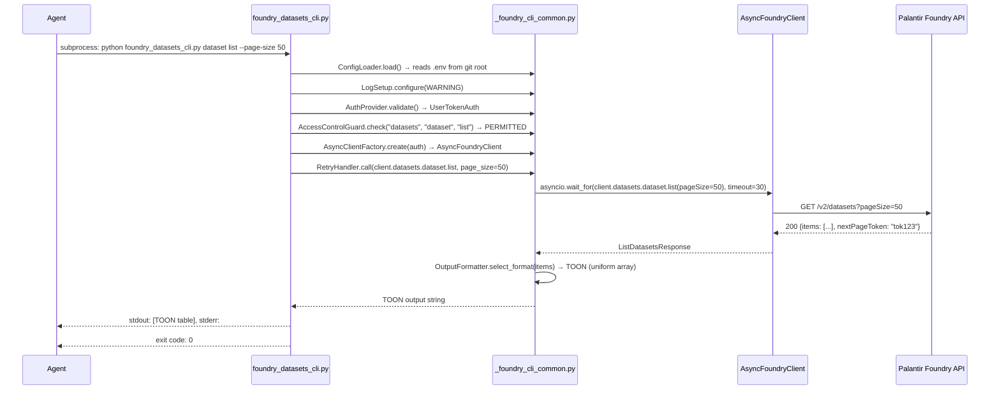
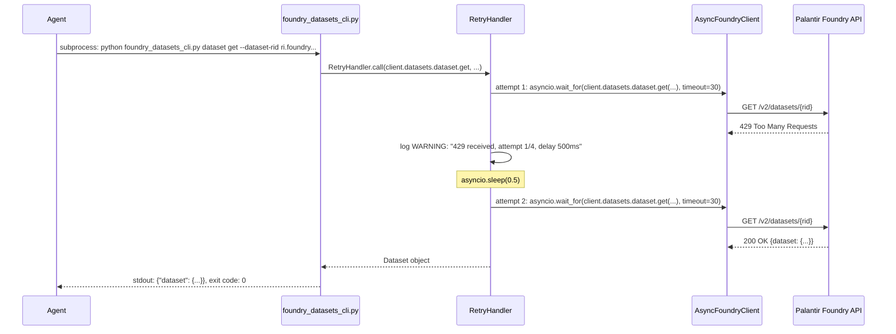
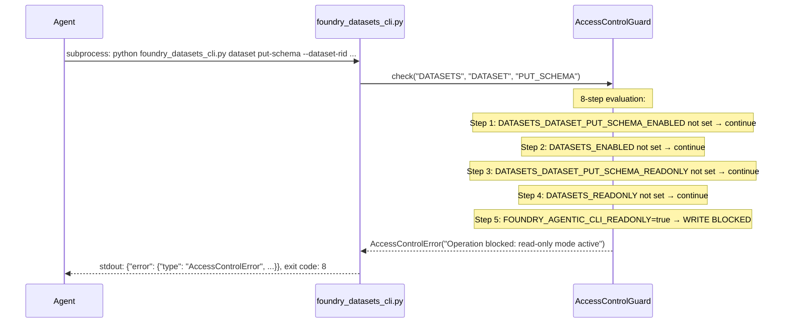
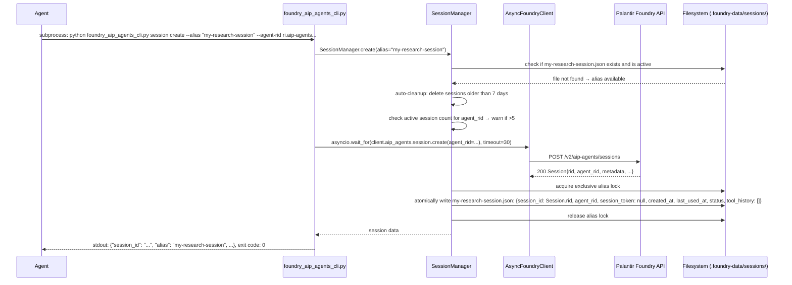
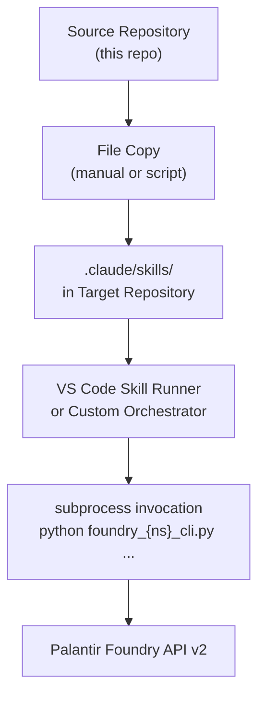

# Solution Architecture Document  
## Foundry CLI — Agentic Toolset for Palantir Foundry API v2

| Field | Value |
|---|---|
| **Document ID** | SAD-001 |
| **Version** | 1.1.0 |
| **Status** | Draft |
| **Date** | 2026-04-13 |
| **Last updated** | 2026-07-27 |
| **Author** | Solution Architect |
| **Feature** | FEATURE-001 |
| **Context ticket** | SA-ANA-001, SA-DES-001 |
| **Related SRS** | SRS-001-foundry-cli.md |
| **Detailed design** | DESIGN-005-common-components.md |

---

## Table of Contents

1. [Introduction](#1-introduction)
2. [C4 Level 1 — System Context](#2-c4-level-1--system-context)
3. [C4 Level 2 — Container Diagram](#3-c4-level-2--container-diagram)
4. [C4 Level 3 — Component Diagram: Common Module](#4-c4-level-3--component-diagram-common-module)
5. [C4 Level 4 — Code Structure](#5-c4-level-4--code-structure)
6. [Sequence Diagrams](#6-sequence-diagrams)
7. [Technology Stack](#7-technology-stack)
8. [Deployment Architecture](#8-deployment-architecture)
9. [Cross-Cutting Concerns](#9-cross-cutting-concerns)
10. [Implementation Roadmap](#10-implementation-roadmap)
11. [Risks and Mitigations](#11-risks-and-mitigations)
12. [Architecture Assumptions and Constraints](#12-architecture-assumptions-and-constraints)

---

## 1. Introduction

### 1.1 Purpose

This Solution Architecture Document (SAD) describes the architectural design for the Foundry CLI Agentic Toolset. It provides C4 model diagrams, sequence flows, technology decisions, deployment topology, and the implementation roadmap for the 21 Claude Code skill packages.

### 1.2 Scope

The SAD covers:
- All 20 namespace CLI skill packages (355 operations)
- The shared common utility module (`_foundry_cli_common.py`)
- The general Foundry knowledge skill (`foundry/SKILL.md`)
- Configuration, access control, and session management subsystems
- Deployment and distribution model

### 1.3 Architecture Principles

| Principle | Implementation |
|---|---|
| **Agentic-first** | Subprocess-compatible CLI; JSON/TOON on stdout; metadata on stderr |
| **Fail fast** | Structured errors with typed exit codes on all failure paths |
| **Zero side-effects by default** | Access control guards run before any SDK call |
| **Single source of truth** | One `_foundry_cli_common.py` copied to each skill; changes propagate on re-copy |
| **Minimal surface area** | No persistent processes; no daemon; stateless per invocation (except session files) |
| **Layered security** | Auth → Access Control → API call order; early rejection at each layer |

---

## 2. C4 Level 1 — System Context



---

## 3. C4 Level 2 — Container Diagram



---

## 4. C4 Level 3 — Component Diagram: Common Module



---

## 5. C4 Level 4 — Code Structure

### Repository Layout

```text
<repo-root>/
├── .claude/
│   └── skills/
│       ├── foundry/
│       │   └── SKILL.md                          # General knowledge skill (auto-loaded)
│       ├── foundry-admin/
│       │   ├── SKILL.md                          # Skill definition + tool docs
│       │   └── scripts/
│       │       ├── foundry_admin_cli.py           # Namespace CLI entry point
│       │       └── _foundry_cli_common.py         # Shared module (copied here)
│       ├── foundry-aip-agents/
│       │   ├── SKILL.md
│       │   └── scripts/
│       │       ├── foundry_aip_agents_cli.py
│       │       └── _foundry_cli_common.py
│       ├── foundry-{namespace}/                   # ×18 more namespace skills
│       │   ├── SKILL.md
│       │   └── scripts/
│       │       ├── foundry_{namespace}_cli.py
│       │       └── _foundry_cli_common.py
│       └── ...
├── .foundry-data/                                 # Runtime data (gitignored)
│   ├── downloads/
│   │   └── {uuid}/
│   │       └── {filename}
│   └── sessions/
│       └── {alias}.json
├── .env                                           # Primary configuration
├── .gitignore                                     # Excludes .foundry-data/
└── .ept/
    └── docs/
        └── deliverables/
            ├── business_analysis/
            │   └── SRS-001-foundry-cli.md
            └── architecture/
                ├── SAD-001-foundry-cli.md          # This document
                ├── canonical-env-var-reference.md
                ├── metadata-allow-list.env
                └── adr/
                    ├── ADR-001-exit-code-taxonomy.md
                    ├── ADR-002-call-timeout-defaults.md
                    ├── ADR-003-streams-batch-strategy.md
                    ├── ADR-004-format-auto-algorithm.md
                    ├── ADR-005-log-format.md
                    ├── ADR-006-env-file-search-path.md
                    └── ADR-007-operation-level-readonly.md
```

### SKILL.md Frontmatter Template (namespace skills)

```yaml
---
name: foundry-{namespace}
description: >
  Foundry {Namespace} skill — exposes {N} operations from the {namespace} namespace
  of the Palantir Foundry API v2. Use this skill to [brief namespace purpose].
user-invocable: true
tools:
  - bash
applyTo:
  - "**"
---
```

### foundry_{namespace}_cli.py Entry Pattern

```python
#!/usr/bin/env python3
"""Foundry {Namespace} CLI — namespace entry point."""

import argparse
import asyncio
import sys
from _foundry_cli_common import (
    ConfigLoader, AuthProvider, AsyncClientFactory,
    AccessControlGuard, RetryHandler, OutputFormatter,
    ErrorSerializer, PaginationHelper, LogSetup
)

NAMESPACE = "{namespace}"

def build_parser() -> argparse.ArgumentParser:
    parser = argparse.ArgumentParser(description="Foundry {Namespace} CLI")
    parser.add_argument("--format", choices=["json", "toon", "auto"], default=None)
    subparsers = parser.add_subparsers(dest="resource", required=True)
    # ... per-resource subparsers
    return parser

async def main_async(args) -> int:
    cfg = ConfigLoader()
    LogSetup.configure(cfg.log_level)
    client = await AsyncClientFactory.create(cfg)
    guard = AccessControlGuard(cfg, NAMESPACE)
    guard.check(args.resource, args.operation)  # exit 8 on block
    handler = RetryHandler(cfg, client)
    formatter = OutputFormatter(args.format or cfg.default_format)
    try:
        result = await handler.call(getattr(client.{namespace}, args.resource), args)
        formatter.emit(result)
        return 0
    except Exception as exc:
        ErrorSerializer.emit(exc, args)
        return ErrorSerializer.exit_code(exc)

def main():
    args = build_parser().parse_args()
    sys.exit(asyncio.run(main_async(args)))

if __name__ == "__main__":
    main()
```

---

## 6. Sequence Diagrams

### 6.1 Successful Operation (list with pagination)



### 6.2 Retry on 429



### 6.3 Access Control Block



### 6.4 Binary Download

```mermaid
sequenceDiagram
    participant Agent
    participant CLI as foundry_datasets_cli.py
    participant DL as BinaryDownloadHandler
    participant SDK as AsyncFoundryClient
    participant Foundry as Palantir Foundry API
    participant FS as Filesystem

    Agent->>CLI: subprocess: python foundry_datasets_cli.py file content --dataset-rid ... --file-path /data/report.parquet

    CLI->>SDK: asyncio.wait_for(client.datasets.file.content(...), timeout=30)
    SDK->>Foundry: GET /v2/datasets/{rid}/files/{path}/content
    Foundry-->>SDK: 200 streaming binary response

    CLI->>DL: BinaryDownloadHandler.save(response_stream)
    DL->>FS: create same-directory temporary file
    loop Until EOF or limit plus one byte observed
        DL->>DL: write and hash at most MAX_DOWNLOAD_BYTES=1572864
    end
    alt extra probe byte observed
        DL->>DL: truncated=true; source_size unknown unless valid Content-Length exists
        DL->>SDK: close stream without reading remainder
    else EOF observed
        DL->>DL: truncated=false; source_size=bytes observed
    end
    DL->>DL: compute MD5 + SHA-256 checksums
    DL->>FS: flush, fsync, os.replace temporary file
    DL-->>CLI: {file_path, file_size, checksums, mime_type, truncated, source_size?, source_size_at_least?}

    CLI-->>Agent: stdout: {"file_path": ".foundry-data/downloads/abc/report.parquet", "file_size": 524288, ...}, exit code: 0
```

### 6.5 Session Creation for AIP Agents



---

## 7. Technology Stack

| Category | Technology | Version | Justification |
|---|---|---|---|
| **Language** | Python | 3.11.x, 3.12.x | NFR-PLAT-1; SDK requirement |
| **Foundry SDK** | foundry-platform-python | In-repo copy | NFR-DIST-1; version-locked to known-good state |
| **HTTP client** | httpx (via SDK) | ≥0.25.0,<1.0.0 | SDK dependency; async-native |
| **Async runtime** | asyncio | stdlib | FR-ASYNC-1; zero extra dependency |
| **Output: TOON** | toon-python | ≥0.9,<1.0 | FR-OUT-5; git-installable |
| **Output: JSON** | json | stdlib | Performance; no extra dependency |
| **Config loading** | python-dotenv | Latest stable | ADR-006; lightweight; production-tested |
| **Arg parsing** | argparse | stdlib | No extra dependency; sufficient for CLI use |
| **Data validation** | pydantic (via SDK) | ≥2.6.0,<3.0.0 | SDK dependency; reuse for response models |
| **Checksums** | hashlib | stdlib | FR-DL-5; no extra dependency |
| **Session state** | json (stdlib) | stdlib | Simple key-value persistence; no DB overhead |
| **Retry logic** | Custom (asyncio) | N/A | ADR-002; full control over backoff algorithm |
| **Tracing** | SDK `ContextVar` integration with B3 multi-headers | N/A | FR-TRACE-3; no external OTel SDK required |
| **Logging** | logging (stdlib + custom formatter) | N/A | ADR-005; NDJSON to stderr |

---

## 8. Deployment Architecture

### 8.1 Deployment Model

The toolset is deployed by **file copy** to the target repository. There is no build step, no package installation beyond pip dependencies, and no daemon process.



### 8.2 Distribution Package per Namespace

Each skill package copied to the target repository contains:

```text
foundry-{namespace}/
├── SKILL.md              # Claude Code skill definition
└── scripts/
    ├── foundry_{namespace}_cli.py     # CLI entry point (~300-600 LOC)
    └── _foundry_cli_common.py         # Shared module (~500-800 LOC)
```

### 8.3 Required pip Dependencies (target environment)

```text
foundry-platform-sdk>=0.0.0        # From in-repo copy or installed separately
python-dotenv>=1.0.0
toon-python @ git+https://github.com/toon-format/toon-python.git@v0.9
```

### 8.4 Runtime Data Directories

```text
.foundry-data/               # Root of runtime data (gitignored)
├── downloads/               # Created on first download operation
│   └── {uuid4}/
│       └── {filename}       # Binary content
└── sessions/                # Created on first session operation
    └── {alias}.json         # Session state (7-day TTL)
```

### 8.5 Platform Notes

| Platform | Notes |
|---|---|
| **Windows 11** | Use `python` (not `python3`); path separators handled by `pathlib.Path`; git root walk uses `Path.parents` |
| **macOS** | `python3` typically; same pathlib usage |
| **Linux** | `python3`; standard behaviour |
| **All platforms** | `asyncio.run()` works identically; SIGTERM handling via `loop.add_signal_handler()` (Unix only — Windows uses `signal.signal()`) |

---

## 9. Cross-Cutting Concerns

### 9.1 Security

| Concern | Mitigation |
|---|---|
| **Token exposure in logs** | `FOUNDRY_TOKEN` never logged; only last 4 chars in debug traces |
| **Token in process args** | Token sourced from env only; never passed as CLI argument |
| **Path traversal in download** | Download paths normalized with `pathlib.Path.resolve()`; validated to be under `.foundry-data/downloads/` |
| **Partial or torn files** | Downloads and sessions use same-directory temporary files, `fsync`, and atomic `os.replace`; failures remove temporary files |
| **Concurrent alias creation** | Exclusive alias locks serialize check-and-create; cleanup skips active locks |
| **Session file permissions** | Session files created with mode `0o600` (owner read/write only) on Unix |
| **Session token exposure** | `session_token` is nullable and unused by the installed SDK; any future non-null value is treated as secret and excluded from logs/stdout |
| **OWASP A02 — Cryptographic Failures** | Files checksummed with MD5+SHA-256 (MD5 for legacy compat only; SHA-256 is the integrity check) |
| **OWASP A05 — Security Misconfiguration** | No home-dir `.env` loading (ADR-006); METADATA_ONLY deny-by-default |
| **OWASP A10 — SSRF** | FOUNDRY_HOSTNAME validated to be a non-localhost hostname before SDK init |

### 9.2 Observability

- Structured NDJSON logs to stderr (ADR-005)
- Per-call UUID as `call_id` in every log record
- Retry events logged at WARNING level with attempt count and delay
- Access control decisions logged at INFO level
- SDK-native B3 propagation when `ENABLE_TRACING=true`: `FOUNDRY_TRACE_ID` → `X-B3-TraceId`, `FOUNDRY_SPAN_ID` → `X-B3-SpanId`, `FOUNDRY_SAMPLED` → `X-B3-Sampled`

### 9.3 Error Handling Strategy

```
Entry point (main)
    └── AccessControlGuard.check() → exit 8 on block
    └── asyncio.run(main_async())
            └── RetryHandler.call()
                    ├── asyncio.wait_for(sdk_call, timeout) → exit 5 on timeout
                    ├── retry on 429/503 up to MAX_ATTEMPTS → exit 7 on exhaustion
                    └── SDK raises exception → ErrorSerializer maps to exit code
                            ├── AuthenticationError → exit 2
                            ├── PermissionDeniedError → exit 3
                            ├── NotFoundError → exit 4
                            ├── ServerError → exit 6
                            └── All others → exit 1
```

### 9.4 Maintainability

- `_foundry_cli_common.py` is the single source of truth for all cross-cutting logic
- Namespace CLI files are thin wrappers (~300-600 LOC) containing only argument parsing and resource routing
- The canonical env var reference table is the authoritative SDK path → env var mapping
- The metadata allow-list is reviewed on every `foundry-platform-python` minor release

---

## 10. Implementation Roadmap

### Phase 1: Core Infrastructure (Sprint 1-2)

**EPIC-001: Core CLI Infrastructure**

| Story | Description | Priority |
|---|---|---|
| DEV-STORY-001 | Implement `_foundry_cli_common.py` with ConfigLoader, AuthProvider, AsyncClientFactory | Critical |
| DEV-STORY-002 | Implement RetryHandler, ErrorSerializer, OutputFormatter (JSON+TOON), LogSetup | Critical |
| DEV-STORY-003 | Implement AccessControlGuard (8-step precedence), PaginationHelper | Critical |
| DEV-STORY-004 | Implement BinaryDownloadHandler, SessionManager, TracingProvider per DESIGN-005 | High |

### Phase 2: High-Priority Namespace Skills (Sprint 3-4)

**EPIC-002: Datasets & Filesystem Skills**

| Story | Description | Priority |
|---|---|---|
| DEV-STORY-005 | `foundry-datasets` skill (26 operations) | Critical |
| DEV-STORY-006 | `foundry-filesystem` skill (31 operations) | High |

**EPIC-003: Ontology & Functions Skills**

| Story | Description | Priority |
|---|---|---|
| DEV-STORY-007 | `foundry-ontologies` skill (67 operations) | Critical |
| DEV-STORY-008 | `foundry-functions` skill (7 operations) | High |

### Phase 3: Platform & Admin Skills (Sprint 5-6)

**EPIC-004: Admin & Security Skills**

| Story | Description | Priority |
|---|---|---|
| DEV-STORY-009 | `foundry-admin` skill (66 operations) | High |
| DEV-STORY-010 | `foundry-audit` skill (2 operations) | Medium |

**EPIC-005: AI & Models Skills**

| Story | Description | Priority |
|---|---|---|
| DEV-STORY-011 | `foundry-aip-agents` skill (13 operations + session management) | High |
| DEV-STORY-012 | `foundry-language-models` skill (2 operations) | High |
| DEV-STORY-013 | `foundry-models` skill (23 operations) | Medium |

### Phase 4: Remaining Skills (Sprint 7-8)

**EPIC-006: Data Pipeline Skills**

| Story | Description | Priority |
|---|---|---|
| DEV-STORY-014 | `foundry-orchestration` skill (20 operations) | High |
| DEV-STORY-015 | `foundry-sql-queries` skill (5 operations) | High |
| DEV-STORY-016 | `foundry-streams` skill (17 operations, batch strategy per ADR-003) | High |
| DEV-STORY-017 | `foundry-connectivity` skill (15 operations) | Medium |

**EPIC-007: Remaining Namespace Skills**

| Story | Description | Priority |
|---|---|---|
| DEV-STORY-018 | `foundry-media-sets` skill (19 operations) | Medium |
| DEV-STORY-019 | `foundry-checkpoints` skill (3 operations) | Medium |
| DEV-STORY-020 | `foundry-data-health` skill (4 operations) | Medium |
| DEV-STORY-021 | `foundry-third-party-applications` skill (9 operations) | Low |
| DEV-STORY-022 | `foundry-widgets` skill (12 operations) | Low |

### Phase 5: Knowledge Skill (Sprint 9)

**EPIC-008: Foundry Knowledge Skill**

| Story | Description | Priority |
|---|---|---|
| DEV-STORY-023 | Author `foundry/` knowledge skill content (static markdown) | High |

---

## 11. Risks and Mitigations

| Risk | Probability | Impact | Mitigation |
|---|---|---|---|
| **TOON library API breaks** | Medium | Medium | Version pin `>=0.9,<1.0`; integration test on install; fallback to JSON on TOON failure |
| **foundry-platform-python SDK update breaks CLI** | High | High | SDK version locked in-repo; explicit review required for SDK upgrade; per-operation test coverage |
| **geo/core namespace has no public operations** | Confirmed | Low | No CLI generated for these namespaces; document explicitly |
| **Python 3.13 compatibility** | Low (near-term) | Medium | Deferred per NFR-PLAT-1; flag as tech debt when 3.13 becomes LTS |
| **FOUNDRY_TOKEN rotation gap** | Medium | High | Document rotation procedure; long-lived tokens are developer responsibility |
| **Air-gapped TOON install** | Low | Medium | OI-6: document pip mirror procedure; fallback to JSON output if TOON unavailable |
| **Session file corruption** | Low | Medium | Atomic replacement prevents torn writes; quarantine malformed files and return a structured load error |
| **Windows SIGTERM handling** | Medium | Low | Use `signal.signal(SIGTERM, handler)` on Windows (`loop.add_signal_handler` not available); document limitation |

---

## 12. Architecture Assumptions and Constraints

| # | Type | Description |
|---|---|---|
| AA-1 | Assumption | The `foundry-platform-python` SDK's `AsyncFoundryClient` is production-stable for all 20 namespaces |
| AA-2 | Assumption | All 355 operations enumerated from the in-repo SDK copy are available on the target Foundry instance |
| AA-3 | Assumption | `geo` and `core` namespaces have 0 public CLI-callable operations (confirmed from SDK inspection) |
| AA-4 | Assumption | The VS Code skill runner invokes skills via subprocess with stdout/stderr capture |
| AC-1 | Constraint | No daemon or persistent process; each CLI invocation is stateless (session files are the only persistence) |
| AC-2 | Constraint | No database; all state is in `.foundry-data/`; alias lock files and atomic replacement provide concurrent write safety |
| AC-3 | Constraint | No network calls during import of `_foundry_cli_common.py`; all SDK calls are at invocation time |
| AC-4 | Constraint | The `asyncio` event loop is never shared across CLI invocations; each invocation creates its own loop via `asyncio.run()` |

---

*SAD-001 v1.1.0 | Generated 2026-04-13 | Updated 2026-07-27 | Foundry CLI Agentic Toolset*
